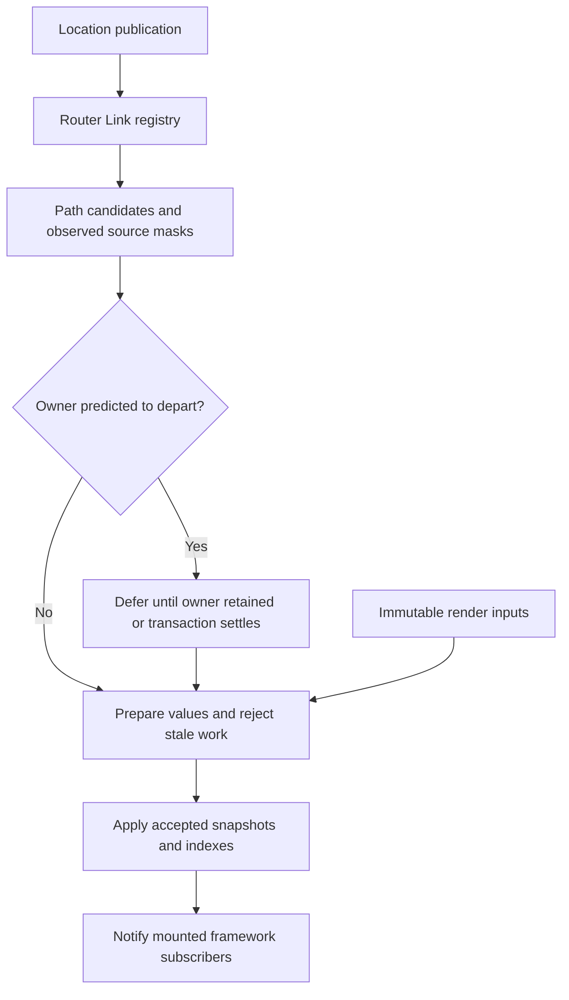

# Link architecture decision record

This refactor moves location-driven Link invalidation into router-core while preserving
public `Link`, `createLink`, and `useLinkProps` APIs across React, Solid, and Vue.
Functional validation, the planned measurement workflows, and emitted-code auditing are
complete for the recorded scope. The result is a measured tradeoff:
selective Link work decreases while all measured application bundles grow. See the
[measurement report](RESULT-optimization-link-architecture.md) for exact scope, source
identities, confidence limits, and attribution. The smaller-overall-bundle aspiration
was not met.

## Problem and decision

Hundreds of mounted Links previously observed location independently. A navigation could
repeat destination and active-state work across the page, including Links about to unmount.
The existing `staticLocations` cache reduced some builds but did not remove notification,
selector, or adapter work. Location publication also precedes rendered-match replacement.

Use a lazy router-owned registry to select Links whose destination or activity may change.
Each mounted Link owns a stable registration and retains its built destination. Immutable
render views hold changing inputs without allowing speculative renders to mutate the live
registration. Actual reads in the canonical location builder determine invalidation masks.
A concrete-path index narrows active-state candidates. Owner-route membership predicts
which Links may depart; the existing navigation transaction reconciles surviving Links.

The registry shares location and transaction authority with the router. It introduces no
second location store, timer-based settlement policy, or per-Link location subscription.
Frameworks retain ownership of rendering, events, refs, preloading, and error boundaries.

## Research and transferable ideas

Primary source and official documentation were inspected on 2026-09-29. The branch links
below are moving snapshots, not pinned release claims. Other routers were not benchmarked.

| Router          | Observed architecture                                                                                           | Transfer and limitation                                                                                                          |
| --------------- | --------------------------------------------------------------------------------------------------------------- | -------------------------------------------------------------------------------------------------------------------------------- |
| Next App Router | Link formats supplied URLs; a shared coordinator registers instances and targets initiating-link pending state. | Router-owned lifecycle is useful. Pending-state targeting does not implement automatic active-link indexing.                     |
| SvelteKit       | Ordinary anchors use delegated interaction handlers, shared viewport preloading, and post-navigation discovery. | Interaction-time work is useful, but ordinary anchors expose fewer component semantics. Scanning still scales with anchor count. |
| React Router    | Link resolves href from route/location context; NavLink computes active/pending pathname tests per component.   | Resolution and activity are distinct concerns. Context-driven activity still has broad notification.                             |
| Vue Router      | `useLink` computes a resolved route, matched-record activity, and params inclusion.                             | Record ancestry is useful evidence, but its activity semantics differ from TanStack's pathname/search matching.                  |
| Nuxt            | Internal client links build on Vue Router; ordinary internal server links have a static-anchor branch.          | Explicit nonreactive SSR and shared visibility infrastructure transfer well. Custom rendering must remain supported.             |
| Solid Router    | Owning-route href resolution is separate from pathname activity; root handlers delegate interaction/preloading. | Fine-grained source fields reduce unrelated work, but pathname changes still reach per-link activity memos.                      |

Next's [Link implementation](https://github.com/vercel/next.js/blob/canary/packages/next/src/client/app-dir/link.tsx)
and [link coordinator](https://github.com/vercel/next.js/blob/canary/packages/next/src/client/components/links.ts)
show callback-ref registration, targeted previous/current pending state, and a shared observer.
Visible-prefetch invalidation still enumerates visible instances. Its
[active-link example](https://nextjs.org/docs/app/api-reference/components/link#checking-active-links)
adds application-level pathname tracking; bare Next Link is not an equivalent workload.

SvelteKit's [client runtime](https://github.com/sveltejs/kit/blob/main/packages/kit/src/runtime/client/client.js)
and [link options](https://svelte.dev/docs/kit/link-options) describe delegated anchors and
inherited navigation/preload attributes. Successful navigation normally resolves redirects
before applying page/tree results, unlike TanStack's early location publication. Delegation
alone would not preserve custom component hooks and non-DOM `useLinkProps` consumers.

React Router's [DOM links](https://github.com/remix-run/react-router/blob/main/packages/react-router/lib/dom/lib.tsx),
[resolution hooks](https://github.com/remix-run/react-router/blob/main/packages/react-router/lib/hooks.tsx),
and [framework prefetch components](https://github.com/remix-run/react-router/blob/main/packages/react-router/lib/dom/ssr/components.tsx)
separate these responsibilities. Resolution memoization avoids repeated identical work;
it does not itself prevent location-context notifications.

Vue Router's [useLink implementation](https://github.com/vuejs/router/blob/main/packages/router/src/RouterLink.ts)
and [active-link semantics](https://router.vuejs.org/guide/essentials/active-links.html)
use matched records and params, exclude query, and recognize aliases by record identity.
Copying that activity rule would change TanStack behavior. Nuxt's
[NuxtLink implementation](https://github.com/nuxt/nuxt/blob/main/packages/nuxt/src/app/components/nuxt-link.ts)
adds static SSR resolution and an app-scoped observer with idle visibility registration.

Solid Router's [A component](https://github.com/solidjs/solid-router/blob/main/src/components.tsx),
[routing primitives](https://github.com/solidjs/solid-router/blob/main/src/routing.ts), and
[delegated events](https://github.com/solidjs/solid-router/blob/main/src/data/events.ts)
separate href, location fields, activity, and interactions. This is the routing foundation
used by SolidStart; no separate SolidStart Link implementation is assumed here.

Our inference is to combine router-owned lifecycle, separate destination/activity inputs,
and pure SSR derivation. None of the inspected sources supplies the complete selective,
owner-aware href/active invalidation design required by TanStack's existing semantics.

## Canonical destination building and observed reads

`buildLocation` and Link derivation use one location-building algorithm in router-core.
An optional internal tracker records source reads during that algorithm; Links retain its
result locally instead of relying on the former `staticLocations` WeakMap.
Existing source-match, path, branch, and interpolation metadata caches remain where useful.

| Mask | Observed dependency                                                         |
| ---- | --------------------------------------------------------------------------- |
| `1`  | Source pathname, route/full-path context, or inherited parsed params.       |
| `2`  | Source search. Validated source search also depends on pathname (`1 \| 2`). |
| `4`  | Source hash preservation or hash updater input.                             |
| `8`  | Source history state preservation or state updater input.                   |

Tracking follows reads, not superficial prop classifications. Literal search can still run
source-dependent middleware; explicit params can still run stringifiers that receive
inherited params. Route validators can change with pathname even when raw search is equal.
Nested masks contribute their reads. An explicit `_fromLocation` fixes the source for that
build and therefore does not subscribe its destination to the router's moving location.
Opaque callbacks are neither introspected nor proxied; masks remain conservative by field.

This preserves the builder's route resolution, params, validation, middleware, masks,
rewrites, and serialization semantics. It also keeps callback ownership and HMR invalidation
in one implementation instead of maintaining a second compiled resolver for Links.

## Candidate selection and formatting

A lazy registry holds mounted records, concrete-path buckets, dependency groups, and deferred
records. Dependency groups use a sparse array indexed by the exact four-bit mask: a Link
belongs to one source group, rather than up to four separate field sets.

For a location publication, the registry unions old/new pathname ancestor buckets with
source groups whose masks intersect the changed fields. A pathname bucket may contain
many Links. Normalization and segment boundaries preserve existing activity rules; ancestor
walking stops before inventing a root-prefix match that the existing predicate would reject.
Records observing every field their activity predicate requires need no redundant path-index
membership: pathname, plus search and hash only when their active options include them.

Activity uses the underlying destination pathname, including for masks and rewrites.
Existing exact/fuzzy search comparison, explicit-undefined treatment, case sensitivity,
basepath handling, and opt-in hash behavior remain authoritative. The index selects possible
changes; it does not replace those predicates with route-record identity.

Displayed href additionally depends on history formatting. Built-in browser/memory histories
have a stable formatting source; hash history declares its actual pathname/search source.
Internal formatting metadata is trusted only while its declared formatter identity matches
`history.createHref`. Unknown custom formatters remain conservative on location publication,
and replacing a formatter invalidates the prior declaration. No sample URL or inferred prefix
is used to approximate arbitrary custom behavior. Protocol checks still apply to formatted
output. Direct external links do not require an internal destination build.

Material router-option changes invalidate derived configuration, including route definitions,
basepath, rewrites, serializers, history, masks, and protocol policy. Route replacement/HMR
also invalidates derived state. Unchanged provider options do not force a full registry sweep.
Framework render-time reads catch changed configuration without notifying arbitrary siblings
during provider rendering. Shared route definitions hold no request-specific registrations.

## Departure prediction and eventual consistency

Only a pending transaction whose location is the published location supplies a departure
prediction. If the Link's owning route ID is absent from that transaction's destination
matches, its location-driven rebuild may wait. Persistent owners and Links without an owner
update immediately. Params/remount rules can cause additional unmounts, so route membership
is deliberately conservative rather than a promise that a component will survive.

The existing transaction's `done` promise is the sole settlement authority. Deferred Links
are reconsidered when a successor publication retains their owner, or after authoritative
settlement. Redirects and cancellations may preserve an apparently departing Link; actual
subscription lifetime wins over the prediction, and surviving records rebuild from the
current accepted location. Unmounted records do no catch-up work.

Successor transactions and stale completion callbacks are checked against current ownership.
There is no copied timeout, extra completion counter, or competing navigation state machine.
Waiting transaction references are released, including on superseded completion, to avoid
retaining settled work. Prop changes remain independently observable during deferral.

## Publication, concurrency, errors, and retention

A stable record owns committed registration/index membership. Each render gets an immutable
input view, which may prepare a snapshot without taking ownership of that registration.
Abandoned React renders therefore cannot retarget the mounted Link or its indexes.
Equal public snapshots reuse their tuple identity before render observes them; adopting a
view cannot replace an already-observed snapshot merely to canonicalize equality afterward.

Registry publication stages previous values and prepared values before applying them.
User callbacks may navigate, change native reactive inputs, or throw. Accepted work must
still belong to the current location/transaction, registered record, current input view,
and staged previous value. That final identity check prevents an older staged value from
overwriting a newer update produced by another callback. Shared refresh logic applies the
same source/configuration checks to render-time and committed derivation.

Accepted snapshots and indexes are applied before notifications. Reentrant notifications
must not leave surviving readers with a mixture of old and newly accepted snapshots.
Derivation errors are captured for the component reader to throw into its framework boundary;
they do not turn an unrelated Link update into a failed router navigation. Failed reads
retain prior dependency information so subsequent relevant changes can recover the Link.

Only committed subscriptions enter router indexes. Cleanup removes path/mask/deferred
membership and clears listeners and retained source references. The last subscriber detaches
the registry's publication hook. Speculative/unsubscribed views can catch up when read;
indexed views release historical sources after adoption. Retention tests exercise actual
mount/unmount ownership, including late settlement, rather than mutating internal sets.

## Framework integration and public behavior

React keeps one stable record per router and one memoized destination view per input set.
A layout effect adopts that view; `useSyncExternalStore` reads its immutable snapshot through
the stable subscription. Destination, appearance, and preload lifetimes remain distinct:
style-only changes should not restart intent timers or viewport observation.
Click navigation reads current render options rather than an old destination's option bag.

Solid adopts views in its owned computation and publishes snapshots through its native
signal. Error delivery stays in the component owner. Vue owns its view/update computation
and callback dependency effect within the component scope; disposal stops that effect and
unsubscribes the record. Temporary callback reads are cleared after evaluation so a live
effect does not retain an old location. Native invalidation follows guarded publication.

Every server branch runs before framework reactive setup. It directly derives the same href
and activity without signals, effects, registry subscriptions, or router-wide Link state.
Custom render functions, disabled/activity semantics, refs, events, preloading, hydration,
security handling, and public type inference remain part of the compatibility contract.

Two preexisting React prop bugs are also corrected: changing `href` now updates the displayed
target/activity and subsequent preload/navigation; changing only `reloadDocument` affects
the next click. These follow from complete destination inputs and current click options,
without changing the public API or adding a separate compatibility mode.

## Alternatives considered and cost limits

- **Central selector sweep:** fewer subscriptions still leave every navigation doing O(N)
  selector/build work. Selection must precede expensive Link derivation.
- **Per-owner location stores:** reduce departing work but retain root-owner fanout and add
  another source authority. Owner identity is instead a conservative scheduling hint.
- **Delegated DOM updates:** attractive for ordinary anchors, but insufficient for render
  props, custom hosts, hooks, refs, and hydration. Shared prefetch observers remain separate.
- **Compiled destination plans or proxy tracking:** duplicate builder semantics or require
  stronger callback contracts. Actual canonical-builder reads give conservative field masks.
- **Global destination interning or a pathname trie:** add lifetime/keying complexity and
  objects. Local retention and map/ancestor lookup are the current measured design candidates.
- **Replacing records on prop changes:** adds subscription/index churn and lets speculative
  renders interfere with committed ownership. Stable records plus immutable views avoid it.

Selection costs include path depth, matching dependency groups, and all selected records.
Repeated destinations, inherited/updater-heavy Links, or configuration changes can still
require O(N) work. Unknown formatter handling conservatively scans mounted records. There
is no claim of constant-time navigation or sublinear work when every Link truly changes.
Mounts pay for records, views, index membership, and subscriptions; updates allocate staging
and candidate structures. These costs must be weighed against avoided builds and renders.

The [measurement report](RESULT-optimization-link-architecture.md) records identical baseline/
candidate workloads for departure, persistence, first mount, source dependencies, formatters,
SSR, memory, and bundle size. Selective-work improvements coexist with inconclusive mount
and SSR timings and larger bundles in all eighteen scenarios. These are explicit measured
tradeoffs; they do not establish universal speedups, equivalence, or a smaller overall bundle.
