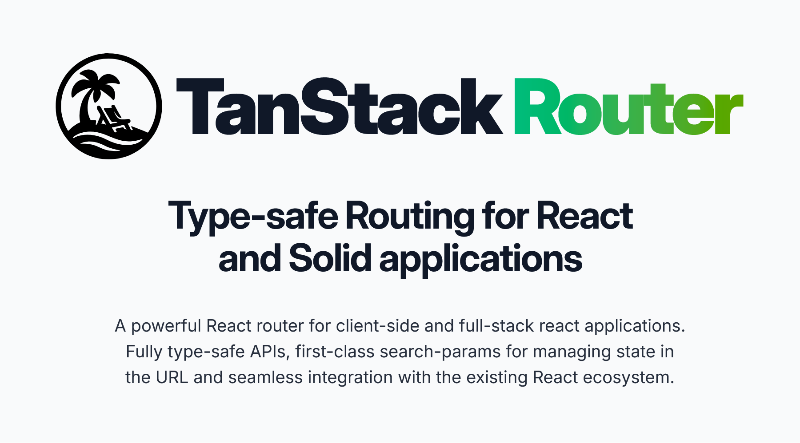

  

    
    

    <h3 style="line-height: 1.25;">TanStack Router</h3>
    

      A modern router designed for type safety, data‑driven navigation, and seamless developer experience.
    

    <ul>
      <li>End‑to‑end type safety (routes, params, loaders)</li>
      <li>Schema‑driven search params with validation</li>
      <li>Built‑in caching, prefetching & invalidation</li>
      <li>Nested layouts, transitions & error boundaries</li>
    </ul>
    
<strong>Use when:</strong> building modern client‑side apps

    <a
      href="https://tanstack.com/router"
      style="font-weight: bold;"
      >Read the Router Docs →</a
    >
    

  

  

    
    

    <h3 style="line-height: 1.25;" >TanStack Start</h3>
     

     A full‑stack framework built on Router, designed for server rendering, streaming, and production‑ready deployments.
     

    <ul>
        <li>Full‑document SSR & streaming</li>
  <li>Server functions & end‑to‑end type safety</li>
  <li>Deployment‑ready bundling & builds</li>
  <li>All the power of TanStack Router, plus full‑stack features</li>
    </ul>
    
<strong>Use when:</strong> building full‑stack production apps

    <a href="https://tanstack.com/start" style="font-weight: bold;">Read the Start Docs →</a>
  

  

  

  
  
  

  
  
  

[Become a Sponsor!](https://github.com/sponsors/tannerlinsley/)

## Get Involved

- We welcome issues and pull requests!
- Participate in [GitHub discussions](https://github.com/TanStack/router/discussions)
- Chat with the community on [Discord](https://discord.com/invite/WrRKjPJ)
- See [CONTRIBUTING.md](./CONTRIBUTING.md) for setup instructions

## Partners

  
  
  
  
  
  
  
  

## Explore the TanStack Ecosystem

<a href="https://github.com/tanstack/config" style="font-weight: bold;">TanStack Config</a> – Tooling for JS/TS packages  
  <a href="https://github.com/tanstack/db" style="font-weight: bold;">TanStack DB</a> – Reactive sync client store  
  <a href="https://github.com/tanstack/config" style="font-weight: bold;">TanStack DevTools</a> – Unified devtools panel  
  <a href="https://github.com/tanstack/form" style="font-weight: bold;">TanStack Form</a> – Type‑safe form state  
  <a href="https://github.com/tanstack/pacer" style="font-weight: bold;">TanStack Pacer</a> – Debouncing, throttling, batching  
  <a href="https://github.com/tanstack/query" style="font-weight: bold;">TanStack Query</a> – Async state & caching  
  <a href="https://github.com/tanstack/ranger" style="font-weight: bold;">TanStack Ranger</a> – Range & slider primitives  
  <a href="https://github.com/tanstack/store" style="font-weight: bold;">TanStack Store</a> – Reactive data store  
  <a href="https://github.com/tanstack/table" style="font-weight: bold;">TanStack Table</a> – Headless datagrids  
  <a href="https://github.com/tanstack/virtual" style="font-weight: bold;">TanStack Virtual</a> – Virtualized rendering  
  … and more at <a href="https://tanstack.com" style="font-weight: bold;">TanStack.com »</a>

<!-- Use the force, Luke -->
