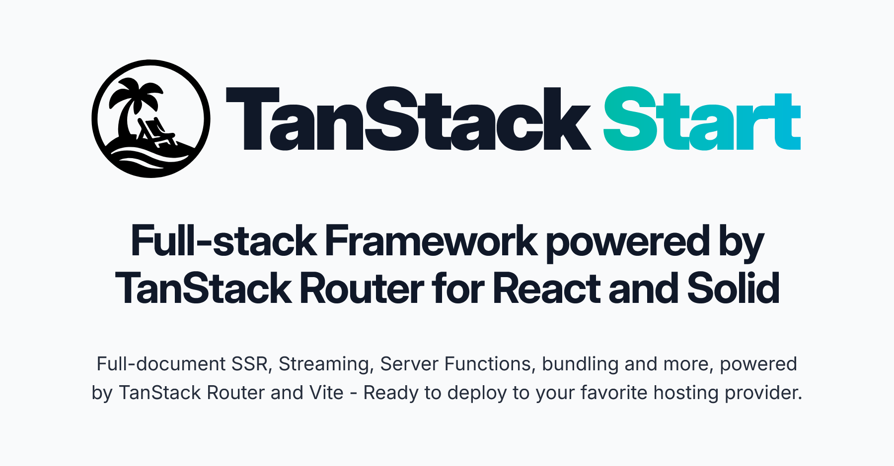

<table>
<tr>
<td>

## TanStack Router

A modern router designed for type safety, data‑driven navigation, and seamless developer experience.

- End‑to-end type safety (routes, params, loaders)
- Schema‑driven search params with validation
- Built‑in caching, prefetching & invalidation
- Nested layouts, transitions & error boundaries

### [Read the Router Docs →](https://tanstack.com/router)

</td>
<td>

## TanStack Start

A full‑stack framework built on Router, designed for server rendering, streaming, and production‑ready deployments.

- Full‑document SSR & streaming
- Server functions & end‑to‑end type safety
- Deployment‑ready bundling & builds
- All the power of TanStack Router, plus full‑stack features

### [Read the Start Docs →](https://tanstack.com/start)

</td>
</tr>
</table>

 

    

    

### [Become a Sponsor!](https://github.com/sponsors/tannerlinsley/)

## Get Involved

- We welcome issues and pull requests!
- Participate in [GitHub discussions](https://github.com/TanStack/router/discussions)
- Chat with the community on [Discord](https://discord.com/invite/WrRKjPJ)
- See [CONTRIBUTING.md](./CONTRIBUTING.md) for setup instructions

## Partners

<table align="center">
  <tr>
    <td>
        <a href="https://www.coderabbit.ai/?via=tanstack&dub_id=aCcEEdAOqqutX6OS">
			<picture>
			  <source media="(prefers-color-scheme: dark)" srcset="https://tanstack.com/assets/coderabbit-dark-CMcuvjEy.svg" height="40" />
			  <source media="(prefers-color-scheme: light)" srcset="https://tanstack.com/assets/coderabbit-light-DVMJ2jHi.svg" height="40" />
			  
			</picture>        
		</a>
    </td>
    <td padding="20">
      <a href="https://www.cloudflare.com?utm_source=tanstack">
         <picture>
    		  <source media="(prefers-color-scheme: dark)" srcset="https://tanstack.com/assets/cloudflare-white-DQDB7UaL.svg" height="60" />
    		  <source media="(prefers-color-scheme: light)" srcset="https://tanstack.com/assets/cloudflare-black-CPufaW0B.svg" height="60" />
    		  
    		</picture>
      </a>
    </td>
    <td>
      <a href="https://netlify.com?utm_source=tanstack">
      <picture>
        <source media="(prefers-color-scheme: dark)" srcset="https://raw.githubusercontent.com/tanstack/tanstack.com/main/src/images/netlify-dark.svg" height="70"/>
        <source media="(prefers-color-scheme: light)" srcset="https://raw.githubusercontent.com/tannerlinsley/files/master/partners/netlify.svg" height="70"/>
        
      </picture>
      </a>
    </td>
  </tr>
  <tr>
    <td>
      <a href="https://neon.tech?utm_source=tanstack">
		  <picture>
	        <source media="(prefers-color-scheme: dark)" srcset="https://raw.githubusercontent.com/tanstack/tanstack.com/main/src/images/neon-dark.svg" height="50"/>
	        <source media="(prefers-color-scheme: light)" srcset="https://raw.githubusercontent.com/tannerlinsley/files/master/partners/neon.svg" height="50"/>
	        
		  </picture>
	  </a>
    </td>
    <td>
      <a href="https://go.clerk.com/wOwHtuJ">
        <picture>
          <source media="(prefers-color-scheme: dark)" srcset="https://tanstack.com/assets/clerk-logo-dark-CRE22T_2.svg" height="40"/>
          <source media="(prefers-color-scheme: light)" srcset="https://raw.githubusercontent.com/tannerlinsley/files/master/partners/clerk.svg" height="40"/>
          
        </picture>
      </a>
    </td>
    <td>
      <a href="https://convex.dev?utm_source=tanstack">
        <picture>
          <source media="(prefers-color-scheme: dark)" srcset="https://raw.githubusercontent.com/tanstack/tanstack.com/main/src/images/convex-white.svg" height="30"/>
          <source media="(prefers-color-scheme: light)" srcset="https://raw.githubusercontent.com/tannerlinsley/files/master/partners/convex.svg" height="30"/>
          
        </picture>
      </a>
    </td>
  </tr>
    <tr>
    <td>
      <a href="https://sentry.io?utm_source=tanstack">
        <picture>
           <source media="(prefers-color-scheme: dark)" srcset="https://raw.githubusercontent.com/tanstack/tanstack.com/main/src/images/sentry-wordmark-light.svg" height="50"/>
          <source media="(prefers-color-scheme: light)" srcset="https://raw.githubusercontent.com/tannerlinsley/files/master/partners/sentry.svg" height="50"/>
          
        </picture>
      </a>
    </td>
    <td>
      <a href="https://www.prisma.io?utm_source=tanstack&via=tanstack">
        <picture>
          <source media="(prefers-color-scheme: dark)" srcset="https://tanstack.com/assets/prisma-dark-DwgDxLwn.svg" height="50"/>
          <source media="(prefers-color-scheme: light)" srcset="https://tanstack.com/assets/prisma-light-Cloa3Onm.svg" height="50"/>
          
        </picture>
      </a>
    </td>
    <td>
      <a href="https://strapi.link/tanstack-start">
        <picture>
          <source media="(prefers-color-scheme: dark)" srcset="https://tanstack.com/assets/strapi-dark-CQ84tQTk.svg" height="40"/>
          <source media="(prefers-color-scheme: light)" srcset="https://tanstack.com/assets/strapi-light-6x7linao.svg" height="40"/>
          
        </picture>
      </a>
    </td>
  </tr>
</table>

We're looking for TanStack Router & Start Partners to join our mission! Partner with us to push the boundaries of TanStack Router & Start and build amazing things together.

<a href="mailto:partners@tanstack.com?subject=TanStack Router & Start Partnership"><b>LET'S CHAT</b></a>

## Explore the TanStack Ecosystem

- <a href="https://github.com/tanstack/config"><b>TanStack Config</b></a> – Tooling for JS/TS packages
- <a href="https://github.com/tanstack/db"><b>TanStack DB</b></a> – Reactive sync client store
- <a href="https://github.com/tanstack/devtools"><b>TanStack DevTools</b></a> – Unified devtools panel
- <a href="https://github.com/tanstack/form"><b>TanStack Form</b></a> – Type‑safe form state
- <a href="https://github.com/tanstack/pacer"><b>TanStack Pacer</b></a> – Debouncing, throttling, batching  
- <a href="https://github.com/tanstack/query"><b>TanStack Query</b></a> – Async state & caching
- <a href="https://github.com/tanstack/ranger"><b>TanStack Ranger</b></a> – Range & slider primitives
- <a href="https://github.com/tanstack/store"><b>TanStack Store</b></a> – Reactive data store
- <a href="https://github.com/tanstack/table"><b>TanStack Table</b></a> – Headless datagrids
- <a href="https://github.com/tanstack/virtual"><b>TanStack Virtual</b></a> – Virtualized rendering

… and more at <a href="https://tanstack.com"><b>TanStack.com »</b></a>

<!-- Use the force, Luke!!! -->
