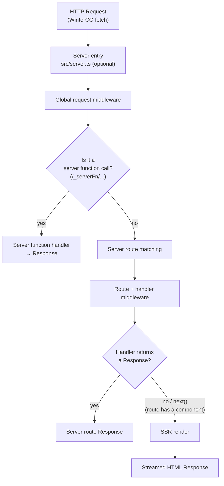

Every request to a TanStack Start app travels through the same pipeline before a response is produced. This guide walks that pipeline end to end — from the moment a request enters your server, through middleware and server routes, to the point where it delegates to SSR and streams HTML back to the client.

Understanding this lifecycle helps you reason about _where_ to put logic: a global middleware for cross-cutting concerns, a server route for an HTTP endpoint, or a route component for a rendered page.

## The big picture



At a high level, a request flows: **entry point → global request middleware → (server function fast-path) → server route matching → route middleware → handler → SSR**. SSR is always the final step in the chain — a server route handler that doesn't return a response delegates to it.

## 1. Where it enters: the server entry point

The entry point is the universal `fetch` handler for your app. It is **optional** — if you don't define `src/server.ts`, TanStack Start generates a default for you that is equivalent to:

```tsx
// auto-generated default
import {
  createStartHandler,
  defaultStreamHandler,
} from '@tanstack/react-start/server'

const fetch = createStartHandler(defaultStreamHandler)

export default createServerEntry({ fetch })
```

When you _do_ define an entry, it must conform to the `ServerEntry` shape — a single `fetch(request, opts?)` method — the same format used by Cloudflare Workers and other WinterCG-compatible runtimes:

```tsx
// src/server.ts
import handler, { createServerEntry } from '@tanstack/react-start/server-entry'

export default createServerEntry({
  fetch(request) {
    return handler.fetch(request)
  },
})
```

Whether you statically generate or serve dynamically, `server.ts` is the entry point for all SSR work, server routes, and server function requests.

> [!NOTE]
> `createServerEntry` only adds type safety — it has no runtime logic of its own. The real pipeline lives inside the `fetch` returned by `createStartHandler`.

See [The Server Entry Point](./server-entry-point) for deployment-specific extensions (e.g. Cloudflare queues and scheduled events).

### Request context

When your server needs to pass typed data into the request (authenticated user info, a database connection, per-request flags), register a request context type via module augmentation. The registered context is delivered as the second argument to the `fetch` handler and is available throughout the entire server-side chain — global middleware, request/function middleware, server routes, server functions, and the router itself.

## 2. Where it goes next: global request middleware

Before anything else runs, every request passes through your **global request middleware**. Register it on your Start instance:

```tsx
// src/start.ts
import { createStart } from '@tanstack/react-start'

export const startInstance = createStart(() => ({
  requestMiddleware: [myGlobalMiddleware],
}))
```

> [!IMPORTANT]
> Global request middleware runs before **every** request — server routes, SSR, and server functions alike.

Each middleware is _next-able_: it must call `next()` to invoke the rest of the chain, which lets it short-circuit, transform the response, or contribute context.

```tsx
import { createMiddleware } from '@tanstack/react-start'

const loggingMiddleware = createMiddleware().server(
  async ({ next, request }) => {
    const start = Date.now()
    const result = await next() // run the rest of the chain (eventually: SSR)
    console.log(`${request.method} ${request.url} — ${Date.now() - start}ms`)
    return result
  },
)
```

Context flows forward through `next({ context })`, and middleware dependencies are resolved **dependency-first** (a middleware's dependencies run before it), with automatic de-duplication so a shared dependency never runs twice.

For the full middleware reference — including server function middleware, `.client()`/`.server()` phases, and `sendContext` — see the [Middleware guide](./middleware).

## 3. The server function fast-path

If the request targets a server function (its path begins with the internal `/_serverFn/` prefix that `createServerFn()` generates), Start handles it on a dedicated path: it runs your global request middleware, then the server function's own middleware and handler, and returns the result.

These requests **never reach server route matching or SSR** — they are an RPC channel, not a page render. Everything else continues to the next stage.

## 4. Server routes

For all other requests, Start matches the incoming URL against your route tree and looks for a **server route** — a `server` block on a file route that defines HTTP method handlers:

```ts
// routes/hello.ts
import { createFileRoute } from '@tanstack/react-router'

export const Route = createFileRoute('/hello')({
  server: {
    handlers: {
      GET: async ({ request }) => {
        return new Response('Hello, World! from ' + request.url)
      },
    },
  },
})
```

Each handler receives the incoming `request`, the matched `params`, and the shared middleware `context`. Method resolution follows HTTP semantics — for example, a `HEAD` request falls back to the `GET` handler (with its body stripped).

A single route can define **both** server handlers and a `component`, letting the same path serve an API method and a rendered page:

```tsx
export const Route = createFileRoute('/hello')({
  server: {
    handlers: {
      POST: async ({ request }) => {
        /* handle the form submission */
        return new Response('Created', { status: 201 })
      },
    },
  },
  component: HelloComponent, // GET renders this page
})
```

## 5. Server route middleware

Server routes support middleware at two levels, and both run **after** your global request middleware:

```tsx
export const Route = createFileRoute('/hello')({
  server: {
    middleware: [authMiddleware], // runs for every handler on this route
    handlers: ({ createHandlers }) =>
      createHandlers({
        GET: async () => new Response('Hello, World!'),
        POST: {
          middleware: [validationMiddleware], // runs only for POST, after authMiddleware
          handler: async ({ request }) => {
            /* ... */
            return new Response('OK')
          },
        },
      }),
  },
})
```

The effective execution order for a matched request is:

1. **Global request middleware** (from `createStart`)
2. **Route-level middleware** — collected from every matched route in the tree, parent to child
3. **Handler-level middleware** — for the specific HTTP method, on an exact match
4. **The method handler** — or, if there is none, SSR

> [!TIP]
> Use pathless layout routes to apply middleware to a group of routes without adding a path segment. See [Server Routes](./server-routes) for the full pattern, including breaking out of inherited middleware.

## 6. How server routes delegate to SSR

This is the key insight that ties the lifecycle together: **SSR is the last step in the route middleware chain, not a separate branch.** After all route and handler middleware, Start appends the SSR renderer as the final link. What happens next depends on your route:

- **No matching server handler** (or a non-exact match) → the request flows straight to SSR and renders your page.
- **A handler that returns a `Response`** → that response is sent; SSR is never reached.
- **A handler that calls `next()`** → it defers to SSR. This is only allowed when the route also defines a `component`.

```tsx
export const Route = createFileRoute('/dashboard')({
  server: {
    handlers: {
      GET: async ({ next, request }) => {
        if (!isAuthenticated(request)) {
          return new Response('Unauthorized', { status: 401 })
        }
        return next() // authenticated → render the page via SSR
      },
    },
  },
  component: Dashboard,
})
```

> [!WARNING]
> If a server route handler returns nothing and the route has **no** `component`, Start throws an error:
> _"It looks like you forgot to return a response from your server route handler. If you want to defer to the app router, make sure to have a component set in this route."_
> Either return a `Response`, or add a `component` so the handler can `next()` to SSR.

### What SSR does

When a request reaches SSR, Start:

1. Resolves the asset manifest (CSS/JS) for the matched routes and fires HTTP 103 Early Hints.
2. Creates the router instance and runs `load()` — executing `beforeLoad` and route `loader`s.
3. Short-circuits if a loader issues a redirect.
4. **Dehydrates** the router's state into the document so the client can hydrate.
5. Builds the response headers (`Content-Type: text/html` plus any per-route headers).
6. Calls your **render handler** to produce the HTML stream.

The render handler is what `createStartHandler` wraps. By default it is `defaultStreamHandler`, which streams the app:

```tsx
export const defaultStreamHandler = defineHandlerCallback(
  ({ request, router, responseHeaders }) =>
    renderRouterToStream({
      request,
      router,
      responseHeaders,
      children: <StartServer router={router} />,
    }),
)
```

You can supply your own to wrap or replace this behavior:

```tsx
// src/server.ts
import {
  createStartHandler,
  defaultStreamHandler,
  defineHandlerCallback,
} from '@tanstack/react-start/server'
import { createServerEntry } from '@tanstack/react-start/server-entry'

const customHandler = defineHandlerCallback((ctx) => {
  // add custom logic here (logging, headers, alternate renderer)
  return defaultStreamHandler(ctx)
})

export default createServerEntry({ fetch: createStartHandler(customHandler) })
```

The renderer picks the right streaming API for your runtime (`renderToReadableStream` on edge/WinterCG runtimes, `renderToPipeableStream` on Node), waits for the full HTML when the request is from a bot, and injects the dehydrated router state into the stream so the client can hydrate seamlessly.

## Summary

| Stage                     | What runs                              | Can it end the request?   |
| ------------------------- | -------------------------------------- | ------------------------- |
| Server entry              | `createServerEntry({ fetch })`         | — (delegates inward)      |
| Global request middleware | `createStart({ requestMiddleware })`   | Yes (short-circuit)       |
| Server function fast-path | server function handler                | Yes                       |
| Server route middleware   | route- and handler-level               | Yes                       |
| Server route handler      | method handler                         | Yes (return a `Response`) |
| SSR                       | `loader`s → dehydrate → render handler | Yes (final step)          |

## Related guides

- [The Server Entry Point](./server-entry-point)
- [Middleware](./middleware)
- [Server Routes](./server-routes)
- [Execution Model](./execution-model)
- [Server Functions](./server-functions)
