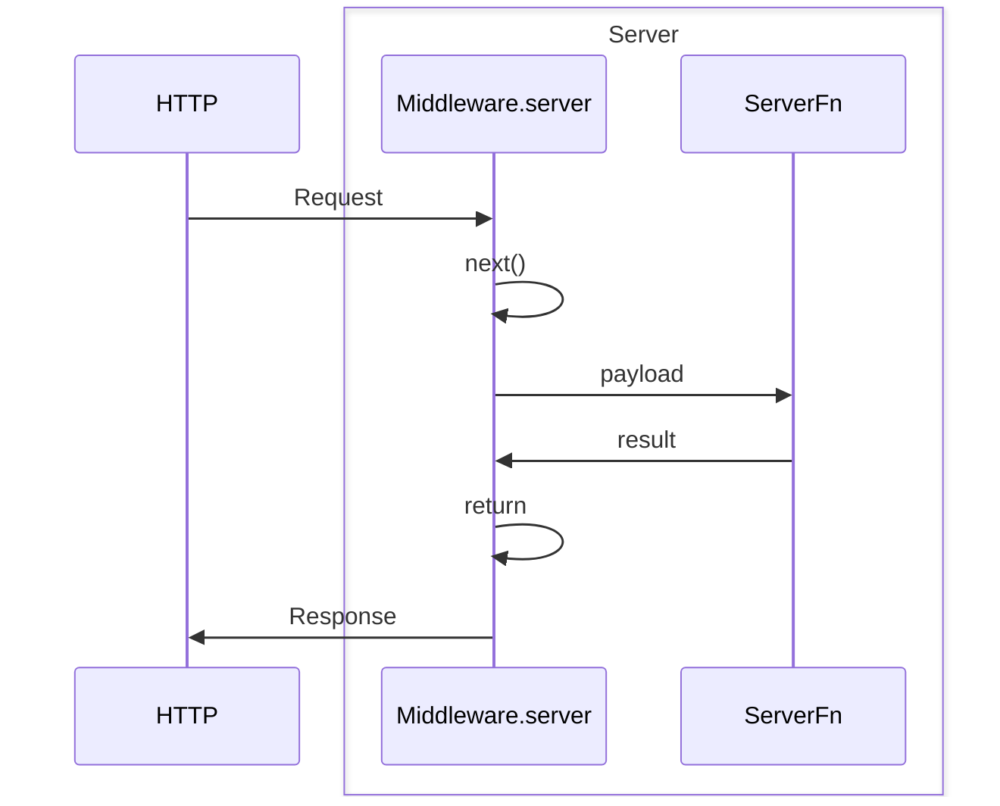
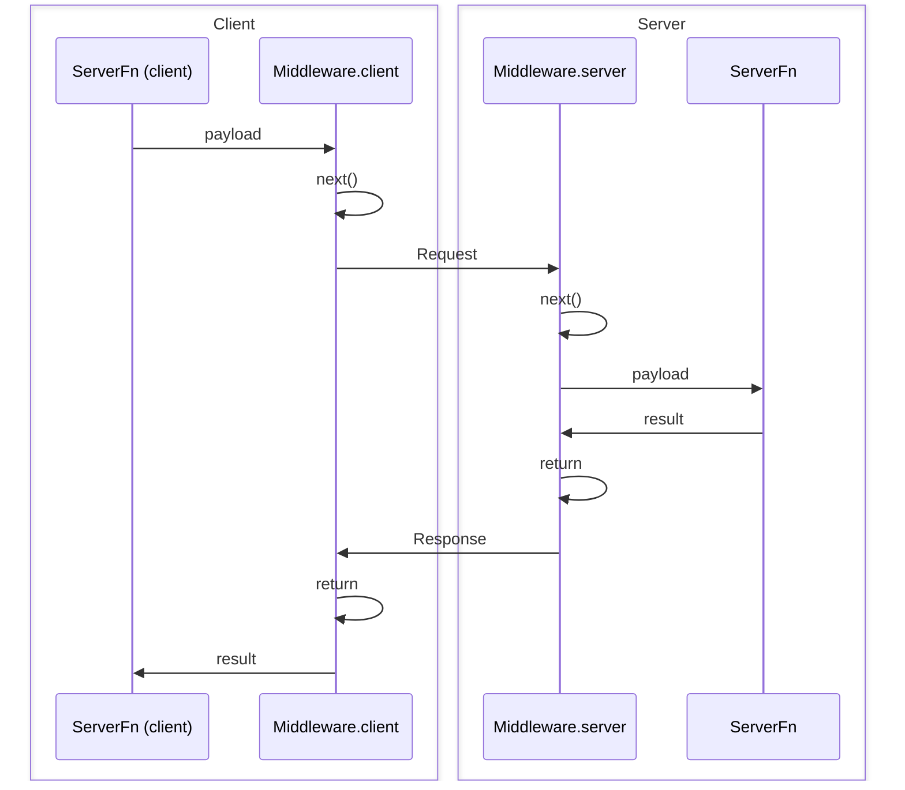

## What is Middleware?

Middleware allows you to customize the behavior of both server routes like GET/POST/etc (including requests to SSR your application) and server functions created with `createServerFn`. Middleware is composable and can even depend on other middleware to create a chain of operations that are executed hierarchically and in order.

### What kinds of things can I do with Middleware?

- **Authentication**: Verify a user's identity before executing a server function.
- **Authorization**: Check if a user has the necessary permissions to execute a server function.
- **Logging**: Log requests, responses, and errors.
- **CSP**: Configure Content Security Policy and other security measures.
- **Observability**: Collect metrics, traces, and logs.
- **Provide Context**: Attach data to the request object for use in other middleware or server functions.
- **Error Handling**: Handle errors in a consistent way.
- And many more! The possibilities are up to you!

## Middleware Types

There are two types of middleware: **request middleware** and **server function middleware**.

- **Request middleware** is used to customize the behavior of any server request that passes through it, including server functions.
- **Server function middleware** is used to customize the behavior of server functions specifically.

> [!NOTE]
> Server function middleware is a subset of request middleware that has extra functionality specifically for server functions like being able to validate input data or perform client-side logic both before and after the server function is executed.

### Key Differences

| Feature           | Request Middleware               | Server Function Middleware |
| ----------------- | -------------------------------- | -------------------------- |
| Scope             | All server requests              | Server functions only      |
| Methods           | `.server()`                      | `.client()`, `.server()`   |
| Input Validation  | No                               | Yes (`.inputValidator()`)  |
| Client-side Logic | No                               | Yes                        |
| Dependencies      | Can depend on request middleware | Can depend on both types   |

> [!NOTE]
> Request middleware cannot depend on server function middleware, but server function middleware can depend on request middleware.

## Core Concepts

### Middleware Composition

All middleware is composable, which means that one middleware can depend on another middleware.

```tsx
import { createMiddleware } from '@tanstack/react-start'

const loggingMiddleware = createMiddleware().server(() => {
  //...
})

const authMiddleware = createMiddleware()
  .middleware([loggingMiddleware])
  .server(() => {
    //...
  })
```

### Progressing the Middleware Chain

Middleware is next-able, which means that you must call the `next` function in the `.server` method (and/or `.client` method if you are creating a server function middleware) to execute the next middleware in the chain. This allows you to:

- Short circuit the middleware chain and return early
- Pass data to the next middleware
- Access the result of the next middleware
- Pass context to the wrapping middleware

```tsx
import { createMiddleware } from '@tanstack/react-start'

const loggingMiddleware = createMiddleware().server(async ({ next }) => {
  const result = await next() // <-- This will execute the next middleware in the chain
  return result
})
```

## Request Middleware

Request middleware is used to customize the behavior of any server request that passes through it, including server routes, SSR and server functions.

To create a request middleware, call the `createMiddleware` function. You may call this function with the `type` property set to 'request', but this is the default value so you can omit it if you'd like.

```tsx
import { createMiddleware } from '@tanstack/react-start'

const loggingMiddleware = createMiddleware().server(() => {
  //...
})
```

### Available Methods

Request middleware has the following methods:

- `middleware`: Add a middleware to the chain.
- `server`: Define server-side logic that the middleware will execute before any nested middleware and ultimately a server function, and also provide the result to the next middleware.

### The `.server` method

The `.server` method is used to define server-side logic that the middleware will execute before any nested middleware, and also provide the result to the next middleware. It receives the `next` method and other things like context and the request object:

```tsx
import { createMiddleware } from '@tanstack/react-start'

const loggingMiddleware = createMiddleware().server(
  ({ next, context, request }) => {
    return next()
  },
)
```

To quickly visualize this handshake, here is a diagram:



### Using Request Middleware with Server Routes

You can use request middleware with server routes in two ways:

#### All Server Route Methods

To have a server route use middleware for all methods, pass a middleware array to the `middleware` property of the method builder object.

```tsx
import { createMiddleware } from '@tanstack/react-start'

const loggingMiddleware = createMiddleware().server(() => {
  //...
})

export const Route = createFileRoute('/foo')({
  server: {
    middleware: [loggingMiddleware],
    handlers: {
      GET: () => {
        //...
      },
      POST: () => {
        //...
      },
    },
  },
})
```

#### Specific Server Route Methods

You can pass middleware to specific server route methods by using the `createHandlers` utility and passing a middleware array to the `middleware` property of the method object.

```tsx
const loggingMiddleware = createMiddleware().server(() => {
  //...
})

export const Route = createFileRoute('/foo')({
  server: {
    handlers: ({ createHandlers }) =>
      createHandlers({
        GET: {
          middleware: [loggingMiddleware],
          handler: () => {
            //...
          },
        },
      }),
  },
})
```

## Server Function Middleware

Server function middleware is a **subset** of request middleware that has extra functionality specifically for server functions like being able to validate input data or perform client-side logic both before and after the server function is executed.

To create a server function middleware, call the `createMiddleware` function with the `type` property set to 'function'.

```tsx
import { createMiddleware } from '@tanstack/react-start'

const loggingMiddleware = createMiddleware({ type: 'function' })
  .client(() => {
    //...
  })
  .server(() => {
    //...
  })
```

### Available Methods

Server function middleware has the following methods:

- `middleware`: Add a middleware to the chain.
- `inputValidator`: Modify the data object before it is passed to this middleware and any nested middleware and eventually the server function.
- `client`: Define client-side logic that the middleware will execute on the client before (and after) the server function calls into the server to execute the function.
- `server`: Define server-side logic that the middleware will execute on the server before (and after) the server function is executed.

> [!NOTE]
> If you are (hopefully) using TypeScript, the order of these methods is enforced by the type system to ensure maximum inference and type safety.

### The `.client` method

The `.client` method is used to define client-side logic that the middleware will wrap the execution and result of the RPC call to the server.

```tsx
import { createMiddleware } from '@tanstack/react-start'

const loggingMiddleware = createMiddleware({ type: 'function' }).client(
  async ({ next, context, request }) => {
    const result = await next() // <-- This will execute the next middleware in the chain and eventually, the RPC to the server
    return result
  },
)
```

### The `.inputValidator` method

The `inputValidator` method is used to modify the data object before it is passed to this middleware, nested middleware, and ultimately the server function. This method should receive a function that takes the data object and returns a validated (and optionally modified) data object. It's common to use a validation library like `zod` to do this.

```tsx
import { createMiddleware } from '@tanstack/react-start'
import { zodValidator } from '@tanstack/zod-adapter'
import { z } from 'zod'

const mySchema = z.object({
  workspaceId: z.string(),
})

const workspaceMiddleware = createMiddleware({ type: 'function' })
  .inputValidator(zodValidator(mySchema))
  .server(({ next, data }) => {
    console.log('Workspace ID:', data.workspaceId)
    return next()
  })
```

### Using Server Function Middleware

To have a middleware wrap a specific server function, you can pass a middleware array to the `middleware` property of the `createServerFn` function.

```tsx
import { createServerFn } from '@tanstack/react-start'
import { loggingMiddleware } from './middleware'

const fn = createServerFn()
  .middleware([loggingMiddleware])
  .handler(async () => {
    //...
  })
```

To quickly visualize this handshake, here is a diagram:



## Context Management

### Providing Context via `next`

The `next` function can be optionally called with an object that has a `context` property with an object value. Whatever properties you pass to this `context` value will be merged into the parent `context` and provided to the next middleware.

```tsx
import { createMiddleware } from '@tanstack/react-start'

const awesomeMiddleware = createMiddleware({ type: 'function' }).server(
  ({ next }) => {
    return next({
      context: {
        isAwesome: Math.random() > 0.5,
      },
    })
  },
)

const loggingMiddleware = createMiddleware({ type: 'function' })
  .middleware([awesomeMiddleware])
  .server(async ({ next, context }) => {
    console.log('Is awesome?', context.isAwesome)
    return next()
  })
```

### Sending Client Context to the Server

**Client context is NOT sent to the server by default since this could end up unintentionally sending large payloads to the server.** If you need to send client context to the server, you must call the `next` function with a `sendContext` property and object to transmit any data to the server. Any properties passed to `sendContext` will be merged, serialized and sent to the server along with the data and will be available on the normal context object of any nested server middleware.

```tsx
const requestLogger = createMiddleware({ type: 'function' })
  .client(async ({ next, context }) => {
    return next({
      sendContext: {
        // Send the workspace ID to the server
        workspaceId: context.workspaceId,
      },
    })
  })
  .server(async ({ next, data, context }) => {
    // Woah! We have the workspace ID from the client!
    console.log('Workspace ID:', context.workspaceId)
    return next()
  })
```

#### Client-Sent Context Security

You may have noticed that in the example above that while client-sent context is type-safe, it is is not required to be validated at runtime. If you pass dynamic user-generated data via context, that could pose a security concern, so **if you are sending dynamic data from the client to the server via context, you should validate it in the server-side middleware before using it.**

```tsx
import { zodValidator } from '@tanstack/zod-adapter'
import { z } from 'zod'

const requestLogger = createMiddleware({ type: 'function' })
  .client(async ({ next, context }) => {
    return next({
      sendContext: {
        workspaceId: context.workspaceId,
      },
    })
  })
  .server(async ({ next, data, context }) => {
    // Validate the workspace ID before using it
    const workspaceId = zodValidator(z.number()).parse(context.workspaceId)
    console.log('Workspace ID:', workspaceId)
    return next()
  })
```

### Sending Server Context to the Client

Similar to sending client context to the server, you can also send server context to the client by calling the `next` function with a `sendContext` property and object to transmit any data to the client. Any properties passed to `sendContext` will be merged, serialized and sent to the client along with the response and will be available on the normal context object of any nested client middleware. The returned object of calling `next` in `client` contains the context sent from server to the client and is type-safe.

> [!WARNING]
> The return type of `next` in `client` can only be inferred from middleware known in the current middleware chain. Therefore the most accurate return type of `next` is in middleware at the end of the middleware chain

```tsx
const serverTimer = createMiddleware({ type: 'function' }).server(
  async ({ next }) => {
    return next({
      sendContext: {
        // Send the current time to the client
        timeFromServer: new Date(),
      },
    })
  },
)

const requestLogger = createMiddleware({ type: 'function' })
  .middleware([serverTimer])
  .client(async ({ next }) => {
    const result = await next()
    // Woah! We have the time from the server!
    console.log('Time from the server:', result.context.timeFromServer)

    return result
  })
```

## Global Middleware

Global middleware runs automatically for every request in your application. This is useful for functionality like authentication, logging, and monitoring that should apply to all requests.

### Global Request Middleware

To have a middleware run for **every request handled by Start**, you can create a middleware and return it as `requestMiddleware` in the `createStart` function in your `src/start.ts` file:

```tsx
// src/start.ts
import { createStart } from '@tanstack/react-start'

const myGlobalMiddleware = createMiddleware().server(() => {
  //...
})

export const startInstance = createStart(() => {
  return {
    requestMiddleware: [myGlobalMiddleware],
  }
})
```

> [!NOTE]
> Global **request** middleware runs before **every request, including server routes, SSR and server functions**.

### Global Server Function Middleware

To have a middleware run for **every server function in your application**, you can create a middleware and return it to the `createStart` function as `functionMiddleware` in your `src/start.ts` file:

```tsx
// src/start.ts
import { createStart } from '@tanstack/react-start'
import { loggingMiddleware } from './middleware'

export const startInstance = createStart(() => {
  return {
    functionMiddleware: [loggingMiddleware],
  }
})
```

### Global Middleware Type Safety

Global middleware types are inherently **detached** from server functions themselves. This means that if a global middleware supplies additional context to server functions or other server function specific middleware, the types will not be automatically passed through to the server function or other server function specific middleware.

To solve this, add the global middleware you are trying to reference to the server function's middleware array. **The global middleware will be deduped to a single entry (the global instance), and your server function will receive the correct types.**

```tsx
import { authMiddleware } from './authMiddleware'

const fn = createServerFn()
  .middleware([authMiddleware])
  .handler(async ({ context }) => {
    console.log(context.user) // <-- Now this will be typed!
    // ...
  })
```

### Middleware Execution Order

Middleware is executed dependency-first, starting with global middleware, followed by server function middleware. The following example will log in this order:

- `globalMiddleware1`
- `globalMiddleware2`
- `a`
- `b`
- `c`
- `d`

```tsx
const globalMiddleware1 = createMiddleware({ type: 'function' }).server(
  async ({ next }) => {
    console.log('globalMiddleware1')
    return next()
  },
)

const globalMiddleware2 = createMiddleware({ type: 'function' }).server(
  async ({ next }) => {
    console.log('globalMiddleware2')
    return next()
  },
)

const a = createMiddleware({ type: 'function' }).server(async ({ next }) => {
  console.log('a')
  return next()
})

const b = createMiddleware({ type: 'function' })
  .middleware([a])
  .server(async ({ next }) => {
    console.log('b')
    return next()
  })

const c = createMiddleware({ type: 'function' })
  .middleware()
  .server(async ({ next }) => {
    console.log('c')
    return next()
  })

const d = createMiddleware({ type: 'function' })
  .middleware([b, c])
  .server(async () => {
    console.log('d')
  })

const fn = createServerFn()
  .middleware([d])
  .server(async () => {
    console.log('fn')
  })
```

## Request and Response Modification

### Reading/Modifying the Server Response

Middleware that uses the `server` method executes in the same context as server functions, so you can follow the exact same [Server Function Context Utilities](../server-functions.md#server-function-context) to read and modify anything about the request headers, status codes, etc.

### Modifying the Client Request

Middleware that uses the `client` method executes in a **completely different client-side context** than server functions, so you can't use the same utilities to read and modify the request. However, you can still modify the request returning additional properties when calling the `next` function. Currently supported properties are:

- `headers`: An object containing headers to be added to the request.

Here's an example of adding an `Authorization` header any request using this middleware:

```tsx
import { getToken } from 'my-auth-library'

const authMiddleware = createMiddleware({ type: 'function' }).client(
  async ({ next }) => {
    return next({
      headers: {
        Authorization: `Bearer ${getToken()}`,
      },
    })
  },
)
```

## Environment and Performance

### Environment Tree Shaking

Middleware functionality is tree-shaken based on the environment for each bundle produced.

- On the server, nothing is tree-shaken, so all code used in middleware will be included in the server bundle.
- On the client, all server-specific code is removed from the client bundle. This means any code used in the `server` method is always removed from the client bundle. `data` validation code will also be removed.
