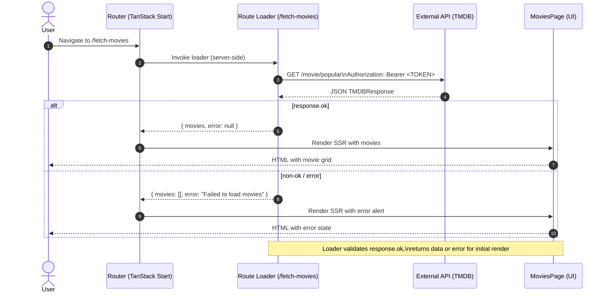

This guide demonstrates how to integrate external API calls into your TanStack Start application using route loaders. We will use TMDB API to fetch popular movies using TanStack Start and understand how to fetch data in a TanStack Start app.

The complete code for this tutorial is available on [GitHub](https://github.com/shrutikapoor08/tanstack-start-movies).

## What You'll Learn

1. Setting up external API integration with TanStack Start
1. Implementing route loaders for server-side data fetching
1. Building responsive UI components with fetched data
1. Handling loading states and error management

## Prerequisites

- Basic knowledge of React and TypeScript
- Node.js (v18+) and `pnpm` installed on your machine
- A TMDB API key (free at [themoviedb.org](https://www.themoviedb.org))

## Nice to know

- [TanStack Router](/router/latest/docs/framework/react/routing/routing-concepts)

## Setting up a TanStack Start Project

First, let's create a new TanStack Start project:

```bash
pnpx create-start-app movie-discovery
cd movie-discovery
```

When this script runs, it will ask you a few setup questions. You can either pick choices that work for you or just press enter to accept the defaults.

Optionally, you can pass in a `--add-on` flag to get options such as Shadcn, Clerk, Convex, TanStack Query, etc.

Once setup is complete, install dependencies and start the development server:

```bash
pnpm i
pnpm dev
```

## Understanding the Project Structure

At this point, the project structure should look like this:

```text
/movie-discovery
├── src/
│   ├── routes/
│   │   ├── __root.tsx                    # Root layout
│   │   ├── index.tsx                     # Home page
│   │   └── fetch-movies.tsx              # Movie fetching route
│   ├── types/
│   │   └── movie.ts                      # Movie type definitions
│   ├── router.tsx                        # Router configuration
│   ├── routeTree.gen.ts                  # Generated route tree
│   └── styles.css                        # Global styles
├── public/                               # Static assets
├── vite.config.ts                         # TanStack Start configuration
├── package.json                          # Project dependencies
└── tsconfig.json                         # TypeScript configuration

```

Once your project is set up, you can access your app at `localhost:3000`. You should see the default TanStack Start welcome page.

## Step 1: Setup a `.env` file with TMDB_AUTH_TOKEN

To fetch movies from the TMDB API, you need an authentication token. You can get this for free at themoviedb.org.

First, let's set up environment variables for our API key. Create a `.env` file in your project root:

```bash
touch .env

```

Add your TMDB API token to this file:

```dotenv
TMDB_AUTH_TOKEN=your_bearer_token_here
```

_Important_: Make sure to add `.env` to your `.gitignore` file to keep your API keys secure.

## Step 2: Defining Data Types

Let's create TypeScript interfaces for our movie data. Create a new file at `src/types/movie.ts`:

```ts
// src/types/movie.ts
export interface Movie {
  id: number
  title: string
  overview: string
  poster_path: string | null
  backdrop_path: string | null
  release_date: string
  vote_average: number
  popularity: number
}

export interface TMDBResponse {
  page: number
  results: Movie[]
  total_pages: number
  total_results: number
}
```

## Step 3: Creating the Route with API Fetch Function

To call the TMDB API, we're going to create a server function that fetches data on the server. This approach keeps our API credentials secure by never exposing them to the client.
Let's create our route that fetches data from the TMDB API. Create a new file at `src/routes/fetch-movies.tsx`:

```typescript
// src/routes/fetch-movies.tsx
import { createFileRoute } from '@tanstack/react-router'
import type { Movie, TMDBResponse } from '../types/movie'
import { createServerFn } from '@tanstack/react-start'

const API_URL =
  'https://api.themoviedb.org/3/discover/movie?include_adult=false&include_video=false&language=en-US&page=1&sort_by=popularity.desc'

const fetchPopularMovies = createServerFn().handler(
  async (): Promise<TMDBResponse> => {
    const response = await fetch(API_URL, {
      headers: {
        accept: 'application/json',
        Authorization: `Bearer ${process.env.TMDB_AUTH_TOKEN}`,
      },
    })

    if (!response.ok) {
      throw new Error(`Failed to fetch movies: ${response.statusText}`)
    }

    return response.json()
  },
)

export const Route = createFileRoute('/fetch-movies')({
  component: MoviesPage,
  loader: async (): Promise<{ movies: Movie[]; error: string | null }> => {
    try {
      const moviesData = await fetchPopularMovies()
      return { movies: moviesData.results, error: null }
    } catch (error) {
      console.error('Error fetching movies:', error)
      return { movies: [], error: 'Failed to load movies' }
    }
  },
})
```

_What's happening here:_

- `createServerFn()` creates a server-only function that runs exclusively on the server, ensuring our `TMDB_AUTH_TOKEN` environment variable never gets exposed to the client. The server function makes an authenticated request to the TMDB API and returns the parsed JSON response.
- The route loader runs on the server when a user visits /fetch-movies, calling our server function before the page renders
- Error handling ensures the component always receives valid data structure - either the movies or an empty array with an error message
- This pattern provides server-side rendering, automatic type safety, and secure API credential handling out of the box.

## Step 4: Building the Movie Components

Now let's create the components that will display our movie data. Add these components to the same `fetch-movies.tsx` file:

```tsx
// MovieCard component
const MovieCard = ({ movie }: { movie: Movie }) => {
  return (
    <div
      className="bg-white/10 border border-white/20 rounded-lg overflow-hidden backdrop-blur-sm shadow-md hover:shadow-xl transition-all duration-300 hover:scale-105"
      aria-label={`Movie: ${movie.title}`}
      role="group"
    >
      {movie.poster_path && (
        
      )}
      <div className="p-4">
        <MovieDetails movie={movie} />
      </div>
    </div>
  )
}

// MovieDetails component
const MovieDetails = ({ movie }: { movie: Movie }) => {
  return (
    <>
      <h3 className="text-lg font-semibold mb-2 line-clamp-2">{movie.title}</h3>
      <p className="text-sm text-gray-300 mb-3 line-clamp-3 h-10">
        {movie.overview}
      </p>
      <div className="flex justify-between items-center text-xs text-gray-400">
        <span>{movie.release_date}</span>
        <span className="flex items-center">
          ⭐️ {movie.vote_average.toFixed(1)}
        </span>
      </div>
    </>
  )
}
```

## Step 5: Creating the MoviesPage Component

Finally, let's create the main component that consumes the loader data:

```tsx
// MoviesPage component
const MoviesPage = () => {
  const { movies, error } = Route.useLoaderData()

  return (
    <div
      className="flex items-center justify-center min-h-screen p-4 text-white"
      style={{
        backgroundColor: '#000',
        backgroundImage:
          'radial-gradient(ellipse 60% 60% at 0% 100%, #444 0%, #222 60%, #000 100%)',
      }}
      role="main"
      aria-label="Popular Movies Section"
    >
      <div className="w-full max-w-6xl p-8 rounded-xl backdrop-blur-md bg-black/50 shadow-xl border-8 border-black/10">
        <h1 className="text-3xl mb-6 font-bold text-center">Popular Movies</h1>

        {error && (
          <div
            className="text-red-400 text-center mb-4 p-4 bg-red-900/20 rounded-lg"
            role="alert"
          >
            {error}
          </div>
        )}

        {movies.length > 0 ? (
          <div
            className="grid grid-cols-1 md:grid-cols-2 lg:grid-cols-3 xl:grid-cols-4 gap-6"
            aria-label="Movie List"
          >
            {movies.slice(0, 12).map((movie) => (
              <MovieCard key={movie.id} movie={movie} />
            ))}
          </div>
        ) : (
          !error && (
            <div className="text-center text-gray-400" role="status">
              Loading movies...
            </div>
          )
        )}
      </div>
    </div>
  )
}
```

### Understanding How It All Works Together



Let's break down how the different parts of our application work together:

1. Route loader: When a user visits `/fetch-movies`, the loader function runs on the server
2. API call: The loader calls `fetchPopularMovies()` which makes an HTTP request to TMDB
3. Server-Side rendering: The data is fetched on the server reducing the load on the client side
4. Component rendering: The `MoviesPage` component receives the data via `Route.useLoaderData()`
5. Rendering UI: The movie cards are rendered with the fetched data

## Step 6: Testing Your Application

Now you can test your application by visiting [http://localhost:3000/fetch-movies](http://localhost:3000/fetch-movies). If everything is set up correctly, you should see a grid of popular movies with their posters, titles, and ratings. Your app should look like this:


## Conclusion

You've successfully built a movie discovery app that integrates with an external API using TanStack Start. This tutorial demonstrated how to use route loaders for server-side data fetching and building UI components with external data.

While fetching data at build time in TanStack Start is perfect for static content like blog posts or product pages, it's not ideal for interactive apps. If you need features like real-time updates, caching, or infinite scrolling, you'll want to use [TanStack Query](/query/latest) on the client side instead. TanStack Query makes it easy to handle dynamic data with built-in caching, background updates, and smooth user interactions. By using TanStack Start for static content and TanStack Query for interactive features, you get fast loading pages plus all the modern functionality users expect.
