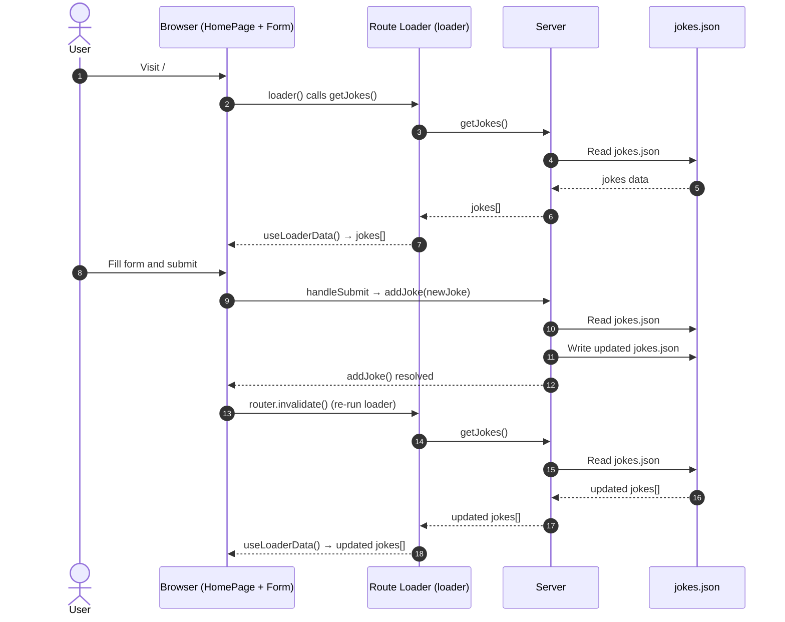

This tutorial will guide you through building a complete full-stack application using TanStack Start. You'll create a DevJokes app where users can view and add developer-themed jokes, demonstrating key concepts of TanStack Start including server functions, file-based data storage, and React components.

Here's a demo of the app in action:

<iframe width="560" height="315" src="https://www.youtube.com/embed/zd0rtKbtlgU?si=7W1Peoo0W0WvZmAd" title="YouTube video player" frameborder="0" allow="accelerometer; autoplay; clipboard-write; encrypted-media; gyroscope; picture-in-picture; web-share" referrerpolicy="strict-origin-when-cross-origin" allowfullscreen></iframe>

The complete code for this tutorial is available on [GitHub](https://github.com/shrutikapoor08/devjokes).

## What You'll Learn

1. Setting up a TanStack Start project
2. Implementing server functions
3. Reading and writing data to files
4. Building a complete UI with React components
5. Using TanStack Router for data fetching and navigation

## Prerequisites

- Basic knowledge of React and TypeScript.
- Node.js and `pnpm` installed on your machine

## Nice to know

- [Server Side Rendering (SSR)](/router/latest/docs/framework/react/guide/ssr)
- [TanStack Router concepts](/router/latest/docs/framework/react/routing/routing-concepts)
- [React Query concepts](/query/latest/docs/framework/react/overview)

## Setting up a TanStack Start Project

First, let's create a new TanStack Start project:

```bash
pnpm create @tanstack/start@latest devjokes
cd devjokes
```

When this script runs, it will ask you a few setup questions. You can either pick choices that work for you or just press enter to accept the defaults.

Optionally, you can pass in a `--add-on` flag to get options such as Shadcn, Clerk, Convex, TanStack Query, etc.

Once setup is complete, install dependencies and start the development server:

```bash
pnpm i
pnpm dev
```

For this project, we'll need the `uuid` package:

```bash
# Install uuid for generating unique IDs
pnpm add uuid
```

## Understanding the project structure

At this point, the project structure should look like this -

```
/devjokes
├── src/
│   ├── routes/
│   │   ├── demo/                         # Demo routes
│   │   ├── __root.tsx                    # Root layout
│   │   └── index.tsx                     # Home page
│   ├── components/                       # React components
│   ├── data/                             # Data files
│   ├── router.tsx                        # Router configuration
│   ├── routeTree.gen.ts                  # Generated route tree
│   └── styles.css                        # Global styles
├── public/                               # Static assets
├── vite.config.ts                        # TanStack Start configuration
├── package.json                          # Project dependencies
└── tsconfig.json                         # TypeScript configuration
```

This structure might seem overwhelming at first, but here are the key files you need to focus on:

1. `src/router.tsx` - Sets up routing for your application
2. `src/routes/__root.tsx` - The root layout component where you can add global styles and components
3. `src/routes/index.tsx` - Your home page

Once your project is set up, you can access your app at `localhost:3000`. You should see the default TanStack Start welcome page.

At this point, your app will look like this:


## Step 1: Reading Data From a File

Let's start by creating a file-based storage system for our jokes.

### Step 1.1: Create a JSON File with Jokes

Let's set up a list of jokes that we can use to render on the page. Create a `jokes.json` file within `src/data`:

```bash
touch src/data/jokes.json
```

Now, let's add some sample jokes to this file:

```json
[
  {
    "id": "1",
    "question": "Why don't keyboards sleep?",
    "answer": "Because they have two shifts"
  },
  {
    "id": "2",
    "question": "Are you a RESTful API?",
    "answer": "Because you GET my attention, PUT some love, POST the cutest smile, and DELETE my bad day"
  },
  {
    "id": "3",
    "question": "I used to know a joke about Java",
    "answer": "But I ran out of memory."
  },
  {
    "id": "4",
    "question": "Why do Front-End Developers eat lunch alone?",
    "answer": "Because, they don't know how to join tables."
  },
  {
    "id": "5",
    "question": "I am declaring a war.",
    "answer": "var war;"
  }
]
```

### Step 1.2: Create Types for Our Data

Let's create a file to define our data types. Create a new file at `src/types/index.ts`:

```typescript
// src/types/index.ts
export interface Joke {
  id: string
  question: string
  answer: string
}

export type JokesData = Joke[]
```

### Step 1.3: Create Server Functions to Read the File

Let's create a new file `src/serverActions/jokesActions.ts` to create a server function to perform a read-write operation. We will be creating a server function using [`createServerFn`](https://tanstack.com/start/latest/docs/framework/react/server-functions).

```tsx
// src/serverActions/jokesActions.ts
import { createServerFn } from '@tanstack/react-start'
import * as fs from 'node:fs'
import type { JokesData } from '../types'

const JOKES_FILE = 'src/data/jokes.json'

export const getJokes = createServerFn({ method: 'GET' }).handler(async () => {
  const jokes = await fs.promises.readFile(JOKES_FILE, 'utf-8')
  return JSON.parse(jokes) as JokesData
})
```

In this code, we are using `createServerFn` to create a server function that reads the jokes from the JSON file. The `handler` function is where we are using the `fs` module to read the file.

### Step 1.4: Consume Server Function on the Client Side

Now to consume this server function, we can simply call it in our code using TanStack Router which already comes with TanStack Start!

Now let's create a new component `JokesList` to render the jokes on the page with a little Tailwind styling sprinkle.

```tsx
// src/components/JokesList.tsx
import { Joke } from '../types'

interface JokesListProps {
  jokes: Joke[]
}

export function JokesList({ jokes }: JokesListProps) {
  if (!jokes || jokes.length === 0) {
    return <p className="text-gray-500 italic">No jokes found. Add some!</p>
  }

  return (
    <div className="space-y-4">
      <h2 className="text-xl font-semibold">Jokes Collection</h2>
      {jokes.map((joke) => (
        <div
          key={joke.id}
          className="bg-white p-4 rounded-lg shadow-md border border-gray-200"
        >
          <p className="font-bold text-lg mb-2">{joke.question}</p>
          <p className="text-gray-700">{joke.answer}</p>
        </div>
      ))}
    </div>
  )
}
```

Now let's call our server function inside `index.tsx` using TanStack Router which already comes with TanStack Start!

```jsx
// src/routes/index.tsx
import { createFileRoute } from '@tanstack/react-router'
import { getJokes } from './serverActions/jokesActions'
import { JokesList } from './JokesList'

export const Route = createFileRoute('/')({
  loader: async () => {
    // Load jokes data when the route is accessed
    return getJokes()
  },
  component: App,
})

const App = () => {
  const jokes = Route.useLoaderData() || []

  return (
    <div className="max-w-2xl mx-auto py-12 px-4 space-y-6">
      <h1 className="text-4xl font-bold text-center mb-10">DevJokes</h1>
      <JokesList jokes={jokes} />
    </div>
  )
}
```

When the page loads, `jokes` will have data from the `jokes.json` file already!

With a little Tailwind styling, the app should look like this:


## Step 2: Writing Data to a File

So far, we have been able to read from the file successfully! We can use the same approach to write to the `jokes.json` file using `createServerFunction`.

### Step 2.1: Create Server Function to Write to the File

It's time to modify the `jokes.json` file so that we can add new jokes to it. Let's create another server function but this time with a `POST` method to write to the same file.

```tsx
// src/serverActions/jokesActions.ts
import { createServerFn } from '@tanstack/react-start'
import * as fs from 'node:fs'
import { v4 as uuidv4 } from 'uuid' // Add this import
import type { Joke, JokesData } from '../types'

const JOKES_FILE = 'src/data/jokes.json'

export const getJokes = createServerFn({ method: 'GET' }).handler(async () => {
  const jokes = await fs.promises.readFile(JOKES_FILE, 'utf-8')
  return JSON.parse(jokes) as JokesData
})

// Add this new server function
export const addJoke = createServerFn({ method: 'POST' })
  .inputValidator((data: { question: string; answer: string }) => {
    // Validate input data
    if (!data.question || !data.question.trim()) {
      throw new Error('Joke question is required')
    }
    if (!data.answer || !data.answer.trim()) {
      throw new Error('Joke answer is required')
    }
    return data
  })
  .handler(async ({ data }) => {
    try {
      // Read the existing jokes from the file
      const jokesData = await getJokes()

      // Create a new joke with a unique ID
      const newJoke: Joke = {
        id: uuidv4(),
        question: data.question,
        answer: data.answer,
      }

      // Add the new joke to the list
      const updatedJokes = [...jokesData, newJoke]

      // Write the updated jokes back to the file
      await fs.promises.writeFile(
        JOKES_FILE,
        JSON.stringify(updatedJokes, null, 2),
        'utf-8',
      )

      return newJoke
    } catch (error) {
      console.error('Failed to add joke:', error)
      throw new Error('Failed to add joke')
    }
  })
```

In this code:

- We are using `createServerFn` to create server functions that run on the server but can be called from the client. This server function is used to write data to the file.
- We are going to first use `inputValidator` to validate the input data. This is a good practice to ensure that the data we are receiving is in the correct format.
- We are going to perform the actual write operation in the `handler` function.
- `getJokes` reads the jokes from our JSON file.
- `addJoke` validates the input data and adds a new joke to our file.
- We're using `uuidv4()` to generate unique IDs for our jokes.

### Step 2.2: Adding a Form to Add Jokes to our JSON File

Now, let's modify our home page to display jokes and provide a form to add new ones. Let's create a new component called `JokeForm.jsx` and add the following form to it:

```tsx
// src/components/JokeForm.tsx
import { useState } from 'react'
import { useRouter } from '@tanstack/react-router'
import { addJoke } from '../serverActions/jokesActions'

export function JokeForm() {
  const router = useRouter()
  const [question, setQuestion] = useState('')
  const [answer, setAnswer] = useState('')
  const [isSubmitting, setIsSubmitting] = useState(false)
  const [error, setError] = useState<string | null>(null)

  return (
    <form onSubmit={handleSubmit} className="mb-8">
      {error && (
        <div className="bg-red-100 text-red-700 p-2 rounded mb-4">{error}</div>
      )}

      <div className="flex flex-col sm:flex-row gap-4 mb-8">
        <input
          id="question"
          type="text"
          placeholder="Enter joke question"
          className="w-full p-2 border rounded focus:ring focus:ring-blue-300 flex-1"
          value={question}
          onChange={(e) => setQuestion(e.target.value)}
          required
        />

        <input
          id="answer"
          type="text"
          placeholder="Enter joke answer"
          className="w-full p-2 border rounded focus:ring focus:ring-blue-300 flex-1 py-4"
          value={answer}
          onChange={(e) => setAnswer(e.target.value)}
          required
        />

        <button
          type="submit"
          disabled={isSubmitting}
          className="bg-blue-500 hover:bg-blue-600 text-white font-medium rounded disabled:opacity-50 px-4"
        >
          {isSubmitting ? 'Adding...' : 'Add Joke'}
        </button>
      </div>
    </form>
  )
}
```

### Step 2.3: Wire Up the Form to the Server Function

Now, let's wire the form up to our `addJoke` server function in the `handleSubmit` function. Calling a server action is simple! It's just a function call.

```tsx
//JokeForm.tsx
import { useState } from 'react'
import { useRouter } from '@tanstack/react-router'
import { addJoke } from '../serverActions/jokesActions'

export function JokeForm() {
  const router = useRouter()
  const [question, setQuestion] = useState('')
  const [answer, setAnswer] = useState('')
  const [isSubmitting, setIsSubmitting] = useState(false)
  const [error, setError] = useState<string | null>(null)

  const handleSubmit = async () => {
    if (!question || !answer || isSubmitting) return
    try {
      setIsSubmitting(true)
      await addJoke({
        data: { question, answer },
      })

      // Clear form
      setQuestion('')
      setAnswer('')

      // Refresh data
      router.invalidate()
    } catch (error) {
      console.error('Failed to add joke:', error)
      setError('Failed to add joke')
    } finally {
      setIsSubmitting(false)
    }
  }

  return (
    <form onSubmit={handleSubmit} className="mb-8">
      {error && (
        <div className="bg-red-100 text-red-700 p-2 rounded mb-4">{error}</div>
      )}
      <div className="flex flex-col sm:flex-row gap-4 mb-8">
        <input
          id="question"
          type="text"
          placeholder="Enter joke question"
          className="w-full p-2 border rounded focus:ring focus:ring-blue-300 flex-1"
          value={question}
          onChange={(e) => setQuestion(e.target.value)}
          required
        />
        <input
          id="answer"
          type="text"
          placeholder="Enter joke answer"
          className="w-full p-2 border rounded focus:ring focus:ring-blue-300 flex-1 py-4"
          value={answer}
          onChange={(e) => setAnswer(e.target.value)}
          required
        />
        <button
          type="submit"
          disabled={isSubmitting}
          className="bg-blue-500 hover:bg-blue-600 text-white font-medium rounded disabled:opacity-50 px-4"
        >
          {isSubmitting ? 'Adding...' : 'Add Joke'}
        </button>
      </div>
    </form>
  )
}
```

With this, our UI should look like this:


## Understanding How It All Works Together

Let's break down how the different parts of our application work together:

1. **Server Functions**: These run on the server and handle data operations
   - `getJokes`: Reads the jokes from our JSON file
   - `addJoke`: Adds a new joke to our JSON file

2. **TanStack Router**: Handles routing and data loading
   - The loader function fetches jokes data when the route is accessed
   - `useLoaderData` makes this data available in our component
   - `router.invalidate()` refreshes the data when we add a new joke

3. **React Components**: Build the UI of our application
   - `JokesList`: Displays the list of jokes
   - `JokeForm`: Provides a form for adding new jokes

4. **File-Based Storage**: Stores our jokes in a JSON file
   - Reading and writing are handled by Node.js `fs` module
   - Data is persisted between server restarts

## How Data Flows Through the Application

### Data Flow



When a user visits the home page:

1. The `loader` function in the route calls `getJokes()` server function
2. The server reads `jokes.json` and returns the jokes data
3. This data is passed to the `HomePage` component through `useLoaderData()`
4. The `HomePage` component passes the data to the `JokesList` component

When a user adds a new joke:

1. They fill out the form and submit it
2. The `handleSubmit` function calls the `addJoke()` server function
3. The server reads the current jokes, adds the new joke, and writes the updated data back to `jokes.json`
4. After the operation completes, we call `router.invalidate()` to refresh the data
5. This triggers the loader again, fetching the updated jokes
6. The UI updates to show the new joke in the list

Here's a demo of the app in action:

<iframe width="560" height="315" src="https://www.youtube.com/embed/zd0rtKbtlgU?si=7W1Peoo0W0WvZmAd" title="YouTube video player" frameborder="0" allow="accelerometer; autoplay; clipboard-write; encrypted-media; gyroscope; picture-in-picture; web-share" referrerpolicy="strict-origin-when-cross-origin" allowfullscreen></iframe>

## Common Issues and Debugging

Here are some common issues you might encounter when building your TanStack Start application and how to resolve them:

### Server Functions Not Working

If your server functions aren't working as expected:

1. Check that you're using the correct HTTP method (`GET`, `POST`, etc.)
2. Ensure file paths are correct and accessible to the server
3. Check the server console for error messages
4. Make sure you're not using client-only APIs in server functions

### Route Data Not Loading

If route data isn't loading properly:

1. Verify that your loader function is properly implemented
2. Check that you're using `useLoaderData()` correctly
3. Look for errors in the browser console
4. Make sure your server function is working correctly

### Form Submission Issues

If form submissions aren't working:

1. Check for validation errors in your server function
2. Verify that form event prevention (`e.preventDefault()`) is working
3. Make sure state updates are happening correctly
4. Look for network errors in the browser's Developer Tools

### File Reading/Writing Issues

When working with file-based storage:

1. Ensure file paths are correct
2. Check file permissions
3. Make sure you're handling async operations properly with `await`
4. Add proper error handling for file operations

## Conclusion

Congratulations! You've built a full-stack DevJokes app using TanStack Start. In this tutorial, you've learned:

- How to set up a TanStack Start project
- How to implement server functions for data operations
- How to read and write data to files
- How to build React components for your UI
- How to use TanStack Router for routing and data fetching

This simple application demonstrates the power of TanStack Start for building full-stack applications with a minimal amount of code. You can extend this app by adding features like:

- Joke categories
- Ability to edit and delete jokes
- User authentication
- Voting for favorite jokes

The complete code for this tutorial is available on [GitHub](https://github.com/shrutikapoor08/devjokes).
