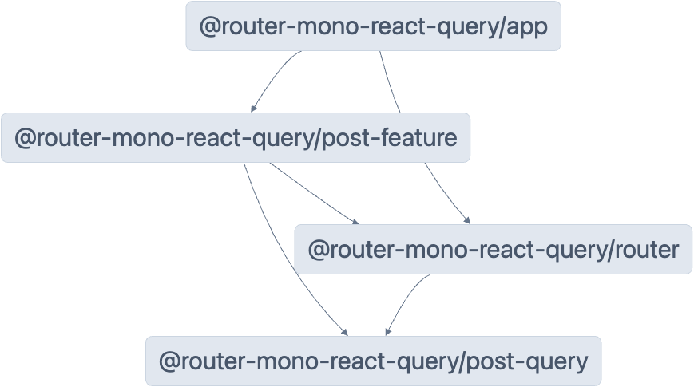

# Example of a monorepo with router and feature libraries

An example demonstrating TanStack Router in a monorepo setup with React Query.

- [TanStack Router Docs](https://tanstack.com/router)
- [TanStack Query Docs](https://tanstack.com/query)

## Start a new project based on this example

To start a new project based on this example, run:

```sh
npx gitpick TanStack/router/tree/main/examples/react/router-monorepo-react-query router-monorepo-react-query
```

## Monorepo Setup

A challenge with TanStack Router in a monorepo setup is that it requires TypeScript type augmentations. However, if you set this up directly in the final app, the links inside the libraries won't be type-safe. To solve this in a monorepo, you need a separate library just for the router, without any components, and then integrate it with the app.

This example showcases this approach using the following packages:

- `packages/router` is the router library
- `packages/post-query` is the post query collection library
- `packages/post-feature` is the posts ui library
- `packages/app` is the app

With this approach, we can use the query options from the data library both in the router and the feature library without creating circular dependencies.

Since the router library re-exports the router components, importing them in the feature library ensures they remain type-safe, as they’re linked to the TypeScript augmentations.

Finally, in the app, we can create a map of routes to components ([`packages/app/src/main.tsx`](./packages/app/src/main.tsx)), which ties the router to the components. **We could enforce lazy loading here, but it was left out for simplicity.** With this setup, we now have a fully type-safe router!

Here is what it looks like in the monorepo:



- **Router library**: Contains route definitions and type augmentations
- **Feature libraries**: Contain components and business logic
- **App**: Integrates the router and feature libraries

## Getting Started

Install dependencies:

```sh
pnpm install
```

Start the development server:

```sh
pnpm dev
```

## Build

Build for production:

```sh
pnpm build
```

## About This Example

This example demonstrates:

- Monorepo structure with TanStack Router
- TanStack Query integration
- Shared data fetching logic
- Workspace configuration
- Code sharing across applications
- Type-safe routing in a monorepo

## Stackblitz limitation

### TypeScript IDE feedback

Due to a limitation on Stackblitz, the example's types are not properly inferred in the IDE, however as soon as you click on fork in the bottom right corner, the types should be correctly inferred.
