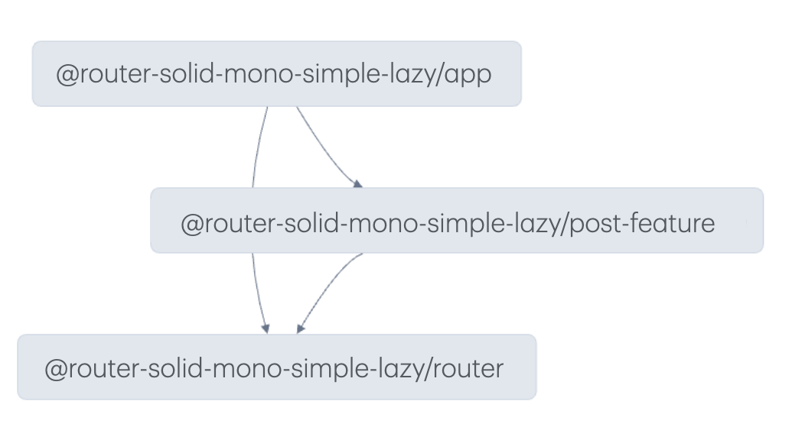

# Example of a monorepo with router and feature libraries, using lazy loading

To run this example:

- `npm install` or `yarn`
- `npm dev` or `yarn dev`

A challenge with TanStack Router in a monorepo setup is that it requires TypeScript type augmentations. However, if you set this up directly in the final app, the links inside the libraries won’t be type-safe. To solve this in a monorepo, you need a separate library just for the router, without any components, and then integrate it with the app.

This example showcases this approach using the following packages:

- `packages/router` is the router library
- `packages/post-feature` is the posts UI library
- `packages/app` is the app

With this approach, we can use loaders in the router and the feature library without creating circular dependencies.

Since the router library re-exports the router components, importing them in the feature library ensures they remain type-safe, as they’re linked to the TypeScript augmentations.

Finally, in the app, we can create a map of routes to components ([`packages/app/src/main.tsx`](./packages/app/src/main.tsx)), which ties the router to the components.

## How lazy loading works

Eath feature exports a `createLazyRoute` function that returns a lazy route. This lazy route is then used in the router map to bind the lazy route to the actual route. This allows library to define their component, pending, error and nod found components directly.

The types on the ([`packages/app/src/main.tsx`](./packages/app/src/main.tsx)) are used to map the route to the lazy route, and enforce they match the route path.

**Note: if you match a lazy route with a different id of the route, you will get a runtime error, hence the mapped types to ensure we are also warned by typescript.**

Here is what it looks like in the monorepo:

## Stackblitz limitation

### Typescript IDE feedback

Due to a limitation on Stackblitz, the example's types are not properly inferred in the IDE, however as soon as you click on fork in the bottom right corner, the types should be correctly inferred.
