# Router Core Match Loading Internals

This document explains how router-core match loading works. It is written for
maintainers changing `src/router.ts`, `src/router-load.*.ts`,
`src/load-matches*.ts`, `src/route-assets.*.ts`, or the framework pending UI
integration.

Match loading is intentionally split between server and client builds. The
server path is request-local and mostly linear. The client path has to handle
navigation cancellation, pending UI, preloads, background stale reloads, route
asset projection, and hydration handoff.

## File Map

- `src/router.ts`
  - Dispatches `router.load()` and `router.preloadRoute()` to server or client
    implementations.
  - Builds route match arrays in `matchRoutesInternal`.
  - Owns `cancelMatches()`, `getMatch()`, `updateMatch()`, cache APIs, and public
    router state. `updateMatch()` patches only live active/pending match stores;
    cache validity is owned by `setCached()` / `clearCache()` / cache
    reconciliation, not by `updateMatch()`.
- `src/router-load.client.ts`
  - Top-level client navigation load orchestration.
  - Publishes pending matches, runs `loadClientMatches`, projects assets, and
    performs the final active-lane commit.
- `src/router-load.server.ts`
  - Top-level server load orchestration.
  - Matches the request location, runs `loadServerMatches`, sets status code and
    redirect state.
- `src/load-matches.ts`
  - Shared types and small helpers for lane context, notFound boundary
    selection, failure normalization, context merging, and promise settlement.
- `src/load-matches.client.ts`
  - Client beforeLoad, loader, preload joining, pending UI, background reload,
    route failure, and lane trimming logic.
- `src/load-matches.server.ts`
  - Server beforeLoad, SSR eligibility, loader, route failure, and server asset
    projection logic.
- `src/router-preload.client.ts`
  - Client route preload entry point. Owns preload cancellation, route-control
    recursion, asset projection, and owned-match cache insertion.
- `src/route-assets.client.ts`
  - Client `head()` and `scripts()` projection for a finished lane.
- `src/route-assets.server.ts`
  - Server `head()`, `scripts()`, and `headers()` projection.
- `src/stores.ts`
  - Active, pending, and cached match pools. The compatibility `__store`
    exposes only public client state (`status`, `isLoading`, `matches`,
    `location`, and `resolvedLocation`).
- `src/ssr/ssr-client.ts`
  - One-shot hydration reconstruction before falling back to normal
    `router.load()` when needed.

## Terminology

### Match

A match is an `AnyRouteMatch` for one route in the matched branch. Important
runtime fields:

- `id`: stable identity built from route id, interpolated pathname, and loader
  deps hash.
- `routeId`: route definition id.
- `index`: position in the matched branch.
- `status`: `pending`, `success`, `error`, or `notFound`.
- `isFetching`: `false`, `beforeLoad`, or `loader`.
- `context`: merged parent context, route context, and beforeLoad context.
- `abortController`: per-generation abort controller. Client work uses it as an
  ownership/currentness token; server `beforeLoad` and loader contexts also
  receive one.
- `_.loadPromise`: private readiness promise used by Suspense,
  pending UI, preloads, and cancellation cleanup.
- `_.dehydrated`: client hydration marker.
- `_.error`: private redirect marker used by preload borrowing.
  notFound and regular error outcomes live on public match state.
- `_displayPending`: hydration-only flag that asks frameworks to render pending
  UI for a hydration display match. The display match can be the SPA fallback or
  the first `ssr: false`/`data-only` match, so it is not always dehydrated.

### Lane

A lane is an ordered array of matches that represents one possible renderable
branch for one location.

The same route branch can exist in several lanes at once:

- **Active lane**: `router.stores.matches`. This is the current rendered router
  state.
- **Pending lane**: `router.stores.pendingMatches`. This is the lane currently
  being navigated to and exposed to readers as pending work.
- **Render-ready pending lane**: a private lane copy that was published into
  `router.stores.matches` by `onReady()` so pending UI can render before the
  final commit.
- **Cached lane entries**: `router.stores.cachedMatches`. These are inactive
  finalized success snapshots from navigation/preload cache ownership. Public
  invalidation may mark them `invalid: true`, but cached entries should remain
  `status: 'success'` until they are reused, expired, or explicitly cleared.
- **Private load lane**: `InnerLoadContext.matches`. This is a mutable array
  owned by one load pass. It is not necessarily published.
- **Preload lane**: a private load pass created with `preload: true`. Owned
  entries have `match.preload === true`; borrowed active/pending entries keep
  their original flag. If a borrowed owner disappears or owns a route-control /
  error outcome, the preload returns without projecting assets or caching owned
  speculative descendants.
- **Background lane**: a private copy of the active lane used for client
  non-blocking reloads. Same-href loads can sometimes skip the foreground final
  commit and become background-only.

The store layer stores lanes as ids plus per-match stores:

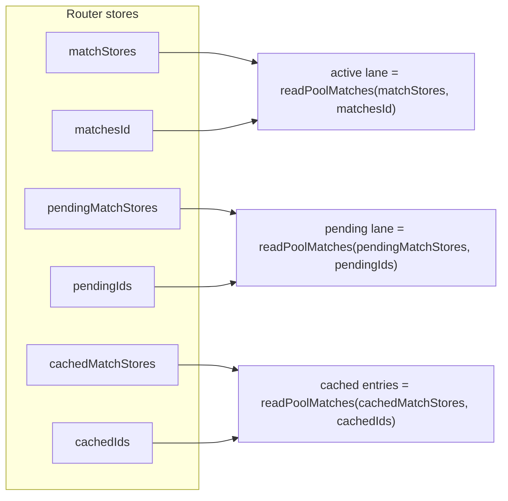

`router.updateMatch(id, updater)` intentionally targets only active or pending
match stores. It does not mutate `cachedMatchStores`, and it is not responsible
for evicting invalid cache entries. Cache publication and eviction go through
`stores.setCached()` and `router.clearCache()` so the cache invariant stays
centralized.

### Commit

There are several kinds of commit. Keep them separate:

- **Private match commit**: `commitMatch(inner, index, patch)` replaces one
  entry in a private lane. This does not publish router state by itself.
- **Pending publication**: `onReady(matches)` publishes a render-ready pending
  lane into active matches so frameworks can render pending UI. It does not run
  route lifecycle hooks, cache reconciliation, `loadedAt`, or the final view
  transition. It also clears the pending match pool for that load pass. It does
  preserve exiting success matches in `cachedMatches` — publication removes
  them from the active pool, and if the load is later superseded the final
  commit that would have cached them never runs.
- **Final client commit**: `commitFinalMatches()` publishes the final active
  lane, reconciles cache, clears pending state, updates `loadedAt`, and runs
  `onLeave`, `onStay`, and `onEnter`.
- **Background commit**: `startBackgroundLoad()` publishes a completed client
  non-blocking reload lane with `stores.setMatches(matches)`. It is atomic for
  data and assets, but it does not run navigation lifecycle hooks.
- **Server commit**: `loadServerRouter()` writes the server lane into
  `stores.matches` and updates server status/redirect properties.

### Current

"Current" means "this async work still owns the state it wants to mutate".

Client match work is current when all of these hold:

- `inner.matches[index]` still exists.
- `inner.matches[index].abortController` is the controller captured by this
  async pass.
- The controller signal has not been aborted.
- If `router.pendingBuiltLocation` exists, its public browser href still equals
  the load context public href.

The helper `requireCurrentMatch(inner, index, controller)` checks those
conditions. It throws `inner` as a private sentinel when ownership is lost.
`loadClientMatches()` recognizes that sentinel and rethrows it so route-error
reduction does not run. The entry point that owns the pass then treats it as
cancellation: foreground navigation cleanup resolves the public load, while
preloads return without projecting assets or caching speculative matches.

Top-level client navigation is current when
`router.latestLoadPromise === loadPromise`.

Background work is current when:

- `router._backgroundLoad === token`.
- The token controller is not aborted.
- The active store location still has the token href.
- There is no `pendingBuiltLocation`.

## Server vs Client Split

`router.ts` chooses the implementation at module initialization:

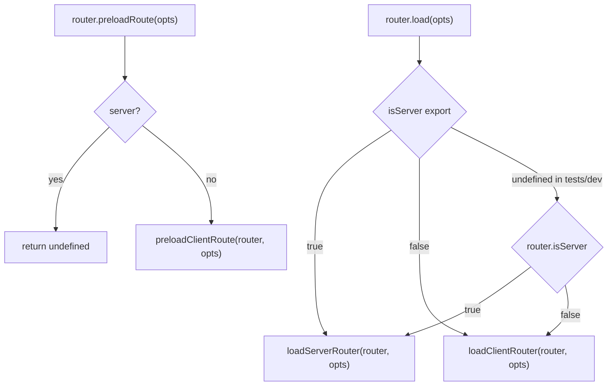

The split is not just an optimization. The two runtimes have different
contracts.

Server match loading:

- Is intended for request-local router instances and assumes no client
  interleaving.
- Does not inspect `router.load(opts)`: `sync`, `action`, request signals,
  preloads, background work, and client currentness are client-side semantics in
  this implementation.
- Does not publish pending UI.
- Does not run client preloads.
- Does not run background stale reloads.
- Does not need foreground current-load checks.
- Does not use stale-time reload decisions.
- Owns status code and redirect response metadata.
- Keeps status code and redirect response metadata as router instance
  properties, not reactive client stores.
- Projects server assets, including headers.

Client match loading:

- Can have overlapping navigations, preloads, background reloads, and hydration
  fallback loads.
- Can publish pending UI before final navigation commit when a pending match's
  pending timer fires.
- Uses `AbortController`, `latestLoadPromise`, and background tokens to reject
  stale async work.
- Projects foreground/background assets with currentness guards, and projects
  successful preload assets only for owned preload entries.
- Caches successful owned preloads and eligible old active matches.

## Match Creation

Both server and client call `router.matchRoutes(location)`. The same function
creates the initial lane.

`matchRoutesInternal()`:

1. Finds matched routes.
2. Handles unmatched/global notFound routing.
3. Validates search params; for new matches, extracts and validates strict path
   params.
4. Computes loader deps and the match id.
5. Reuses an existing match by id when possible.
6. Creates a fresh `AbortController`.
7. Sets `cause` to `preload`, `stay`, or `enter`.
8. Runs route `context()` for new matches.
9. Merges route context and existing beforeLoad context.

New client matches start as `pending` when the route has work that can block
rendering:

- `loader`
- `beforeLoad`
- `lazyFn`
- a component preload (`component`, `errorComponent`, `pendingComponent`,
  `notFoundComponent`)

Server-created matches do not use client pending status for this decision.

Existing matches are shallow-copied into the new lane with fresh
params/search/preload/cause/controller. The private `_` bucket preserves an
existing `_.loadPromise` first, because hydration and pending owners can keep
readiness ownership across rematching. If there is no load promise, the copy
preserves only the dehydrated marker. That copy is a new generation. The old
match may still exist in an active, pending, or cached pool.

## Client Top-Level Navigation Load

`loadClientRouter()` owns the public navigation workflow.

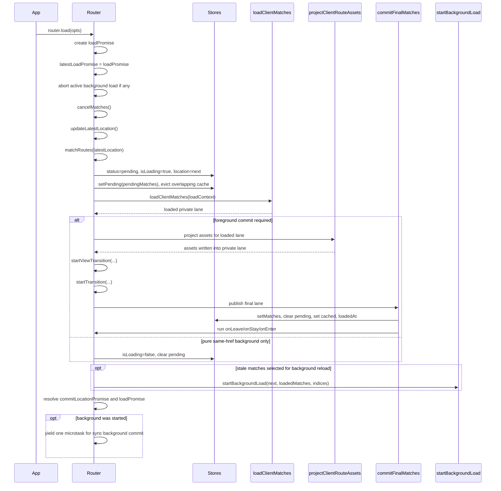

Core sets `status` to `pending` at the start. Normal final commits and
background-only exits clear `isLoading`/pending; foreground redirects clear
pending and start a replacement navigation, whose load later clears
`isLoading`. Framework transitioners are responsible for later marking the
router status idle and updating `resolvedLocation`.

### Background-only foreground pass

When a same-href load finds only non-blocking stale reloads, the foreground pass
does not final-commit. `loadClientRouter()` first filters the selected
background indices against the finalized loaded lane. Only matches that still
exist, are `success`, and are not `globalNotFound` can stay in that list. This
is the `backgroundOnly` case:

- The target href equals the resolved/current href.
- The filtered background list is non-empty.
- No route work set `requiresCommit`.
- No pending UI was published.

The foreground pass clears pending/isLoading and then starts the background
reload. If a background load was started, `loadClientRouter()` yields one
microtask after resolving its public load promise so synchronous background work
can publish its final state before callers observe a transient fetching marker.

## Client Match Loading

`loadClientMatches(inner)` owns the private client lane.

It has two large phases:

1. Run `beforeLoad` serially from root to leaf.
2. Run loader/chunk work in parallel for the renderable prefix.

The serial phase matters because child contexts depend on parent contexts.
The loader phase can be parallel because loader contexts receive a
`parentMatchPromise`.

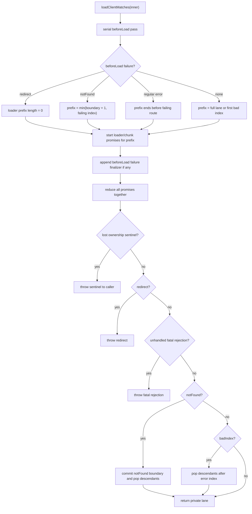

### beforeLoad on the client

`handleClientBeforeLoad()`:

- Creates a load promise when the match has `beforeLoad`, `loader`, or a serial
  validation error.
- Arms the pending timer after serial validation succeeds, when the route can
  show pending UI and the match is still pending.
- Commits `isFetching: 'beforeLoad'` for async beforeLoad, serial validation
  errors, and thrown synchronous beforeLoad failures.
- Calls `beforeLoad` with parent context, params, search, location, navigate,
  `abortController`, and current lane matches.
- Commits `__beforeLoadContext` and merged `context` only after `beforeLoad`
  resolves.
- Converts thrown/returned redirects and notFounds into a serial failure record.

This is why a child loader never sees a half-finished parent beforeLoad context.
When the serial phase records a beforeLoad failure, retained ancestor prefix
loaders run with `inner.background` temporarily disabled. Those reloads belong
to the foreground failure lane and must not be deferred into a background batch
that may be discarded by the boundary trim.

### loader and chunk work on the client

`loadClientRouteMatch()` handles one match:

1. Hydrated matches finish immediately after reconstructing context.
2. Preload-disabled matches finish without running work.
3. Successful matches are checked for invalidation, staleness, or
   `shouldReload`.
4. Non-blocking reloads are selected for background work.
5. Otherwise route chunks and loader run.
6. Loader data is committed into the private lane. If a loader exists, its
   result is written even when the value is `undefined`; a reload that returns
   `undefined` clears stale `loaderData` instead of preserving the previous
   value.
7. `shouldReload`, loader, and route chunk failures are normalized and
   finalized through the same route failure lifecycle (`onError`,
   redirect/notFound conversion). Serial `beforeLoad` failures are finalized
   by `loadClientMatches()` using the same finalizer.
8. `pendingMinMs` is honored if pending UI was rendered.
9. Success clears error/fetching, sets `updatedAt`, and settles load promise.

`parentMatchPromise` points at `matchPromises[index - 1]`, so loaders can wait
for parent work without forcing the whole route branch to become serial.

Lost ownership is not a route outcome. If route work catches `err === inner`, it
rethrows the sentinel instead of reducing it as a route error. The path that
owns the abandoned work is responsible for promise settlement or cleanup before
the pass is dropped.

## Pending UI and pendingMinMs

Pending UI has two timers:

- `pendingMs`: when the route is allowed to publish pending UI.
- `pendingMinMs`: once pending UI is rendered, how long it must remain visible.

Core owns `pendingMs`. Framework match components own `pendingMinMs` by writing
`loadPromise.pendingUntil` only when a pending fallback actually renders for a
still-pending local load promise. Core later observes `pendingUntil` before
committing success/error/notFound/redirect.

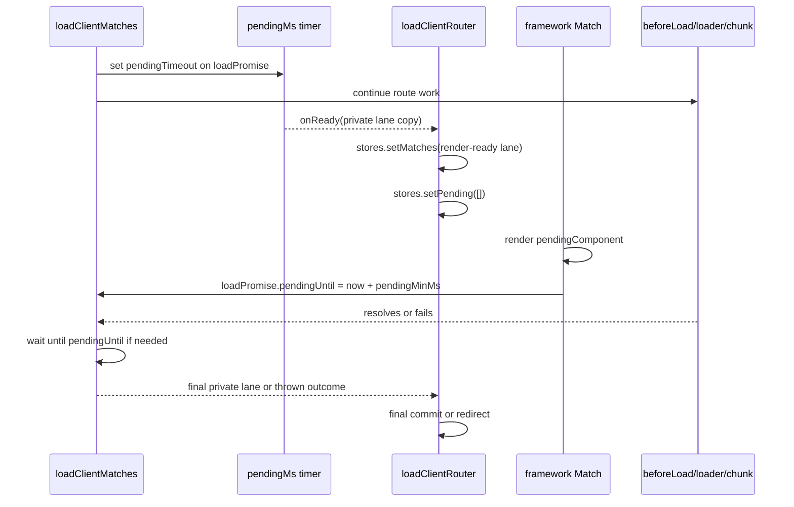

Important invariants:

- Pending publication is not final commit.
- Pending publication does not run lifecycle hooks.
- Pending publication does not reconcile cache.
- Pending publication does not consume the final view transition.
- After pending UI, a renderable same-href outcome still needs a final commit.
  Redirect control flow waits any pending minimum and then navigates instead.

Tests that anchor this behavior include:

- `pending publication runs no lifecycle or cache reconciliation before beforeLoad error final commit`
- `pending publication does not consume the final view transition`
- `visible pending remains until beforeLoad settles after pendingMs plus pendingMinMs`
- `pendingMin wait does not throw after its match is canceled`

## Failure Finalization and Lane Shortening

Route failures can change the size of the lane.

### Regular error

A regular route error commits on the failing match and marks `inner.badIndex`.
Descendants after that match are removed after the promise reduction. Core does
not select an ancestor error boundary for route loading errors; framework error
boundaries handle render-time propagation later.

### notFound

A notFound chooses a notFound boundary with `getNotFoundBoundaryIndex()`. That
boundary may be the throwing route, an ancestor, or root. The final lane is
trimmed to include only matches up to the selected boundary. Non-root boundaries
become `status: 'notFound'`; root/global notFound uses `globalNotFound: true`
on a success root match.

### redirect

A redirect is terminal control flow. In foreground loads, it is resolved by
`router.resolveRedirect` and thrown to `loadClientRouter()`, which calls
`router.navigate()` with `replace: true` and `ignoreBlocker: true`. Background
redirects are handled inside `startBackgroundLoad()`.

### Component/chunk failure while handling another failure

A primary route chunk failure (lazyFn or a route component preload observed by
the loader phase) goes through `normalizeRouteFailure` like loader failures,
so `onError` and redirect/notFound conversion apply. Only when loading an
`errorComponent` or `notFoundComponent` boundary chunk fails does the
component failure replace the original route failure and commit directly as
an error — it must not recursively try to load another boundary component.

Boundary chunk requests are per-component-type: `loadRouteChunk(route,
'errorComponent')` joins that component's own in-flight chunk but never
waits on the whole-route `_componentsPromise`, so an unrelated slow or failed
component chunk cannot block or poison boundary UI. Rejected preloads are
evicted (not cached), so a later load generation can retry.

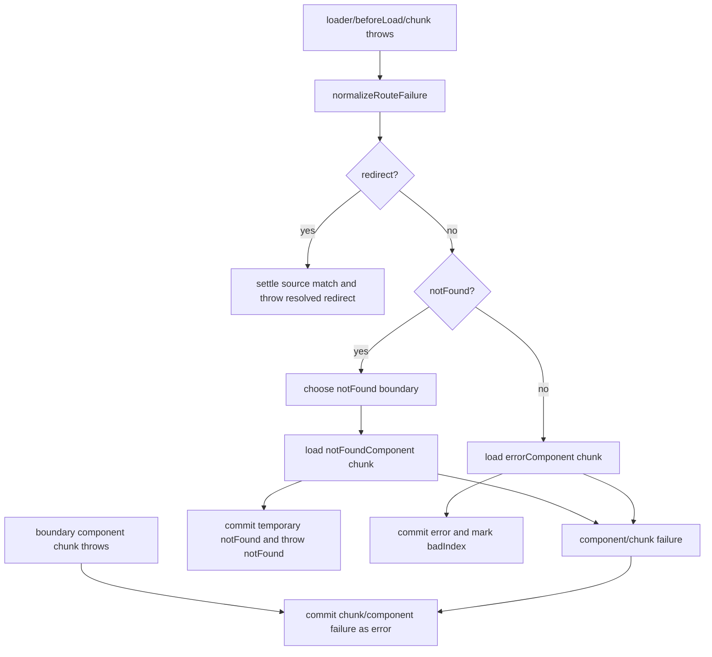

The lane can also change size before loaders start. A serial beforeLoad failure
limits the loader prefix so descendants that cannot render will not run.

## How Lanes Change Size

A lane is an array, and the array length is allowed to change at specific
boundaries.

| Moment                    | How size changes                                                                                                                                                                                                                                                                                   | Why it is allowed                                                                      |
| ------------------------- | -------------------------------------------------------------------------------------------------------------------------------------------------------------------------------------------------------------------------------------------------------------------------------------------------- | -------------------------------------------------------------------------------------- |
| `matchRoutes()`           | The lane length follows the matched URL branch. Unmatched paths can add a notFound route or mark a global notFound boundary.                                                                                                                                                                       | This is initial route matching, before any async work owns the lane.                   |
| New navigation            | The new pending lane can be shorter, longer, or share a prefix with the active lane.                                                                                                                                                                                                               | A different URL can match a different branch.                                          |
| beforeLoad serial failure | The loader prefix is shortened before loader promises are started. For notFound, the prefix is capped at the smaller of `selectedBoundaryIndex + 1` and the throwing route index: ancestor/root boundary loaders may run, but the throwing route and its descendants do not run during the prefix. | Descendants below a redirect/error/notFound outcome cannot render correctly.           |
| Loader or chunk error     | Descendants after `inner.badIndex` are popped.                                                                                                                                                                                                                                                     | The failing match owns the route-loading error state below that point.                 |
| notFound                  | Descendants after the selected notFound boundary are popped.                                                                                                                                                                                                                                       | The chosen boundary is the renderable leaf for this outcome.                           |
| Background error/notFound | The copied background lane is trimmed before atomic publication.                                                                                                                                                                                                                                   | Active state must not see partial stale data or stale head output.                     |
| Final commit              | Replaced active matches are moved into cache if eligible.                                                                                                                                                                                                                                          | The new active lane owns rendering; old successful loader matches may be reused later. |
| Preload finish            | Borrowed matches are not cached; owned successful preload matches may be cached.                                                                                                                                                                                                                   | A preload must not take ownership of active or pending foreground matches.             |

Lane shortening must settle load promises for removed matches. Otherwise
Suspense/preload waiters can remain pending after the match is no longer
reachable.

## Preloads and Match Borrowing

`router.preloadRoute()` is client-only. It builds a preload lane with
`matchRoutes(next, { preload: true, throwOnError: true })`, then calls
`loadClientMatches()` with a list of active and pending match ids that may be
borrowed.

Preloading has two kinds of matches:

- **Borrowed matches**: ids already present in the active or pending lanes.
  The preload observes these read-only and does not cache them as its own work.
- **Owned preload matches**: `match.preload` entries that are not active or
  pending when the successful preload is cached.

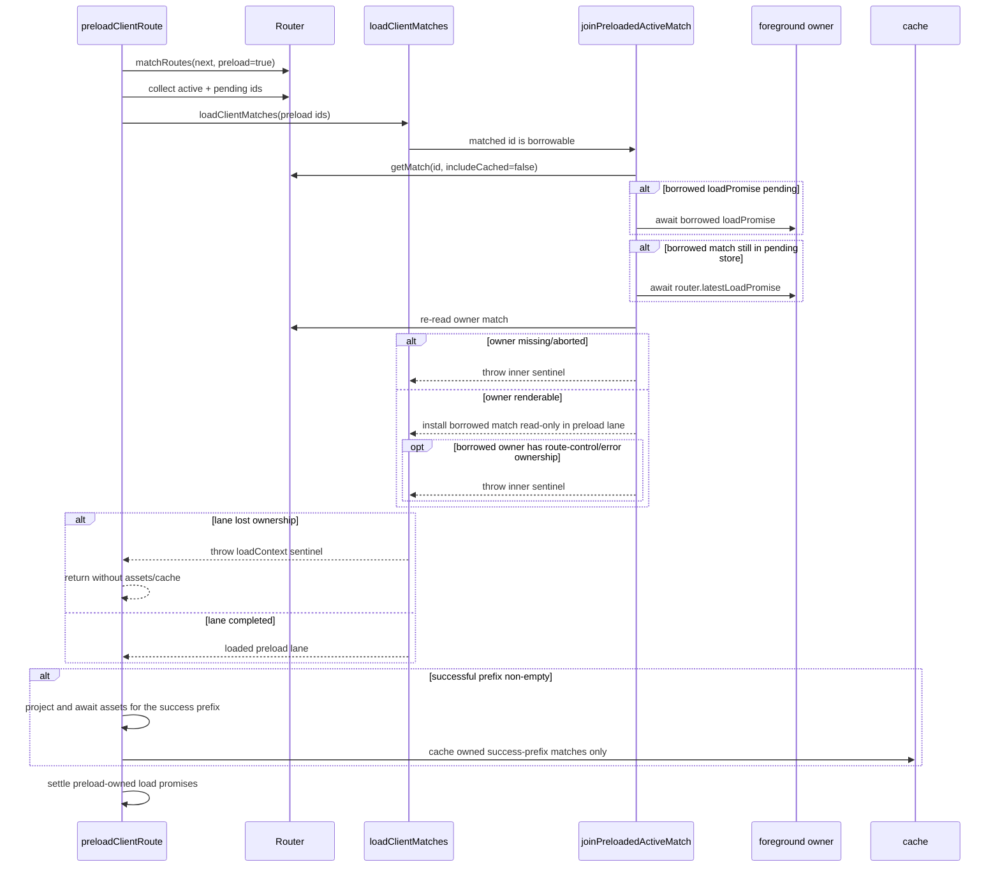

Why wait for both `loadPromise` and sometimes `latestLoadPromise`?

- `loadPromise` says the borrowed match's local work has reached a terminal
  render state.
- `latestLoadPromise` says the foreground owner has actually committed or
  disappeared from the pending store.

Without the foreground wait, a preload can observe a transient pending-store
owner and start descendant work before the navigation that owns the parent has
finished. Tests anchor this with:

- `joined preload waits for borrowed parent success while a sibling is still loading`
- `joined preload waits for borrowed terminal error to commit`
- `joined preload waits for borrowed notFound to commit`
- `preload canceled by borrowed owner disappearance projects no assets and caches nothing`

Preload route-control behavior:

- A private preload redirect recursively preloads the redirect target. It does
  not navigate the active app, and it stops if `reloadDocument` is required.
- A preload notFound or regular error is not fatal to the app.
- Borrowed active redirect/notFound/error stops descendant preload work because
  the active foreground owner already owns that outcome.
- Borrowed matches must re-read as present, un-aborted, and `status: 'success'`
  after any waits. Otherwise the preload throws its private sentinel, projects
  no assets, and caches nothing for speculative descendants.

Cache invariant:

- Pending preload work is private and does not enter `cachedMatches`.
- Failed, redirected, notFound, loaderless transient, and pending speculative
  results should not be cached through public flows.
- `invalidate({ forcePending: true })` keeps cached entries as invalid success
  snapshots instead of turning cached entries into pending matches.
- `clearCache()` is the explicit cleanup path for cached entries and only owns
  cache membership. Public cache entries are written after match readiness has
  settled, so cache removal does not settle synthetic private promises.

## Background Stale Reloads

Background reloads happen only on the client for invalid, stale, or
`shouldReload` successful loader matches whose stale reload mode is not
`blocking`.

The foreground pass selects background indices inside `loadClientRouteMatch()`.
If a same-href load can background every necessary reload without any required
foreground commit or pending publication, `loadClientRouter()` skips final
foreground commit and starts `startBackgroundLoad()`. Other loads can still
start background work after their foreground commit.

Background work is token-owned:

- Starting a new background load aborts the old token.
- Starting a foreground load aborts any active background token and clears
  fetching markers.
- A background token is current only while the active location href still
  matches and no foreground pending location exists.
- Once a worker observes that the token is stale, cancellation is sticky: the
  token is aborted and later workers, asset projection, and publication all stop.
- Background startup rewrites fetching markers across the whole active base lane:
  selected indices become `isFetching: 'loader'`, and non-selected entries are
  reset to `false`.

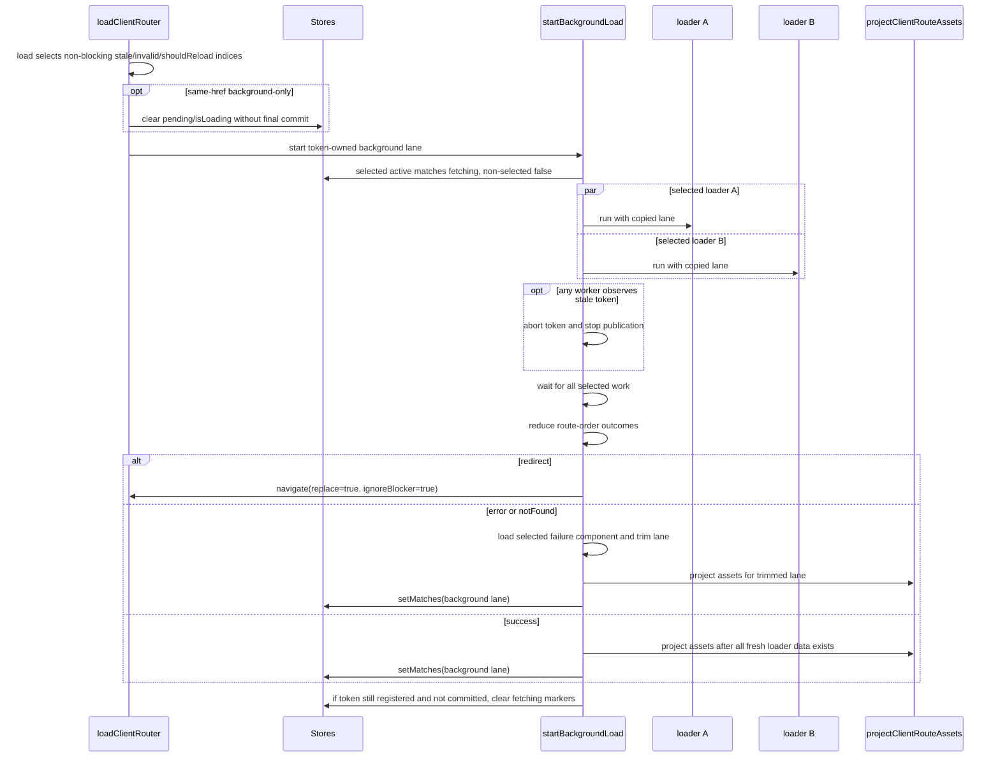

Outcome priority for background batches:

1. Redirect wins over notFound and regular errors.
2. If no redirect wins, the shallowest regular error wins.
3. If there is no regular error, the first selected notFound wins.

Background asset projection waits until all selected loader work has settled.
That keeps data and head coherent. A parent-only background reload can still
republish child head because the child head may derive from parent loader data.
Selected background loaders own their `loaderData` field just like foreground
loaders: an `undefined` result is written into the copied background lane and
asset projection sees that cleared value before the atomic `setMatches()`.

Tests that anchor this behavior include:

- `same-url background beforeLoad context remains private until the atomic background commit`
- `pure same-url background revalidation does not perform a foreground commit`
- `multiple async background loaders flush heads after parent then child resolve`
- `background child redirect waits for parent error and then wins when ... settles first`
- `background parent error waits for child notFound and then wins when ... settles first`
- `background shallow regular error waits for deep regular error and then wins when ... settles first`
- `newer background batch supersedes older batch for the same lane`
- `foreground navigation clears an active background fetching marker before commit`
- `background batch that observed a pending navigation cannot later commit`
- `successful background commit performs one active match publication`

## Route Asset Projection

Route asset projection means executing route `head()`, `scripts()`, and on the
server `headers()`, then writing those results into the match lane.

Projection always uses the lane it is handed. This matters because `head()` can
read `matches`, `match`, params, and loaderData.

Client projection:

- Runs after foreground match loading and before final commit.
- Runs after successful preloads, but only for `match.preload` entries.
- Runs after background loader work completes and before the background atomic
  `setMatches()`.
- Foreground and background projection pass `isCurrent()` checks so stale lanes
  do not mutate or publish assets.
- Preload projection filters to `match.preload` entries and relies on
  owned-match cache checks instead of an `isCurrent()` callback.
- Handles `head()` and `scripts()`, not headers.
- If ownership is lost after an async `head()` or `scripts()` was started, the
  projector observes the abandoned promise with `Promise.allSettled()` before
  returning. This prevents unhandled rejections without committing stale assets
  or continuing to later route asset hooks.
- If `scripts()` throws synchronously after an async `head()` started, client
  projection observes that `head()` promise for the same reason, even when the
  lane is still current.

Server projection:

- After reduction, redirects throw before asset projection. For non-redirect
  outcomes, server projection runs over the trimmed/current lane before
  throwing notFound or route errors. Unhandled fatal rejections project the
  current lane before being rethrown; they may not have a committed error match.
- Handles `head()`, `scripts()`, and `headers()`.
- Does not need currentness checks.
- If `scripts()` or `headers()` throws synchronously after an earlier async asset
  hook started, server projection observes the abandoned earlier promises. Async
  server projection uses `Promise.allSettled()` so one rejected asset hook does
  not leave another hook unobserved.

Hydration projection:

- Is not the same function as normal client projection.
- `ssr-client.ts` waits for route chunks first because lazy chunks can install
  route context, head, and scripts.
- It reconstructs route context from dehydrated data where available, then
  executes head and scripts for each match in the initial hydration lane.
- A `notFound()` thrown by hydration head/scripts records a notFound-shaped
  match error and continues. Other hydration asset/context errors reject,
  settle matches, and clear display pending.

## Currentness and Cancellation

Client currentness exists because async work can resolve after it no longer
owns the lane.

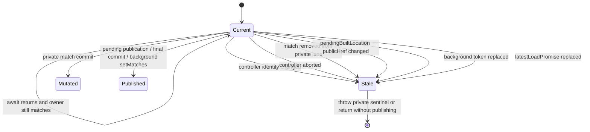

`cancelMatches()` aborts and settles pending and active matches. It skips active
matches that are also in the pending pool so the same match is not canceled
twice. Settling clears `loadPromise`, clears pending timeout, and resolves the
promise if it is still pending.

After foreground/background work detects ownership loss, it must not:

- run route error handling,
- commit or publish asset results, or continue to later asset hooks after
  currentness is lost,
- publish route results into active stores.

Cleanup mutations are different: stale/canceled background work is allowed, and
sometimes required, to clear active `isFetching` markers.

Separately, preload completion must not cache borrowed active/pending matches.

Cancellation and lane-shortening paths must settle removed or canceled load
promises.

Tests that anchor this include:

- `cancelMatches settles pending match load promises immediately`
- `cancelMatches after pending timeout`
- `pending timeout stays scoped to the current load pass`
- `pendingMin wait does not throw after its match is canceled`
- `background reload resolving after route exit does not execute head`
- `background redirect is ignored while a newer navigation is pending`

## Final Client Commit

`commitFinalMatches(router, baseMatches, nextMatches)` is the only normal
navigation final commit.

It does three things:

1. Cache eligible old active matches that were replaced.
2. Publish the next active lane and clear pending state.
3. Run lifecycle diffs.

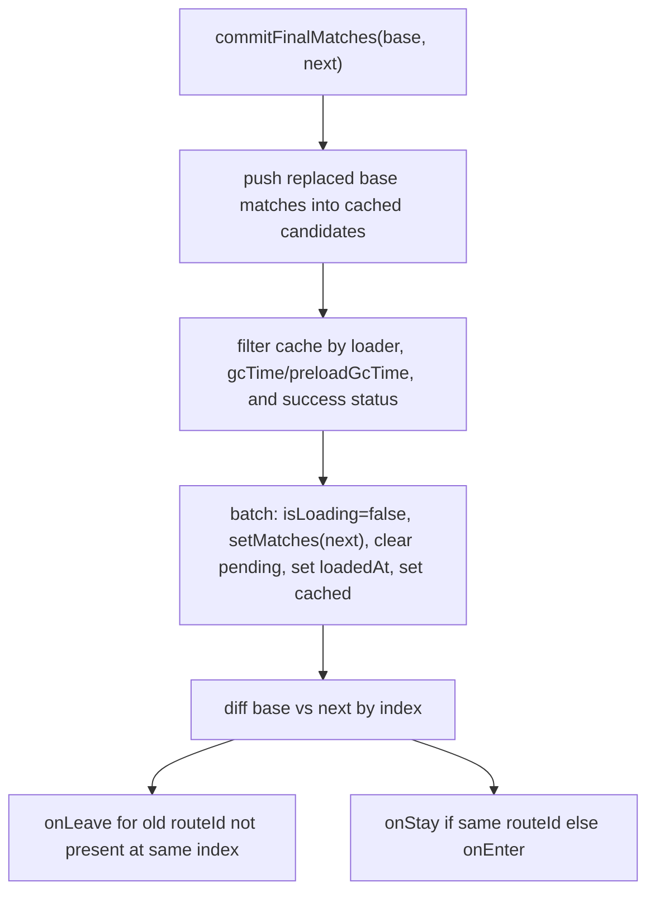

The final commit is intentionally separate from pending publication. Pending UI
is presentation; final commit is router state ownership.

## Server Match Loading

The server path is simpler because there is no client interleaving.

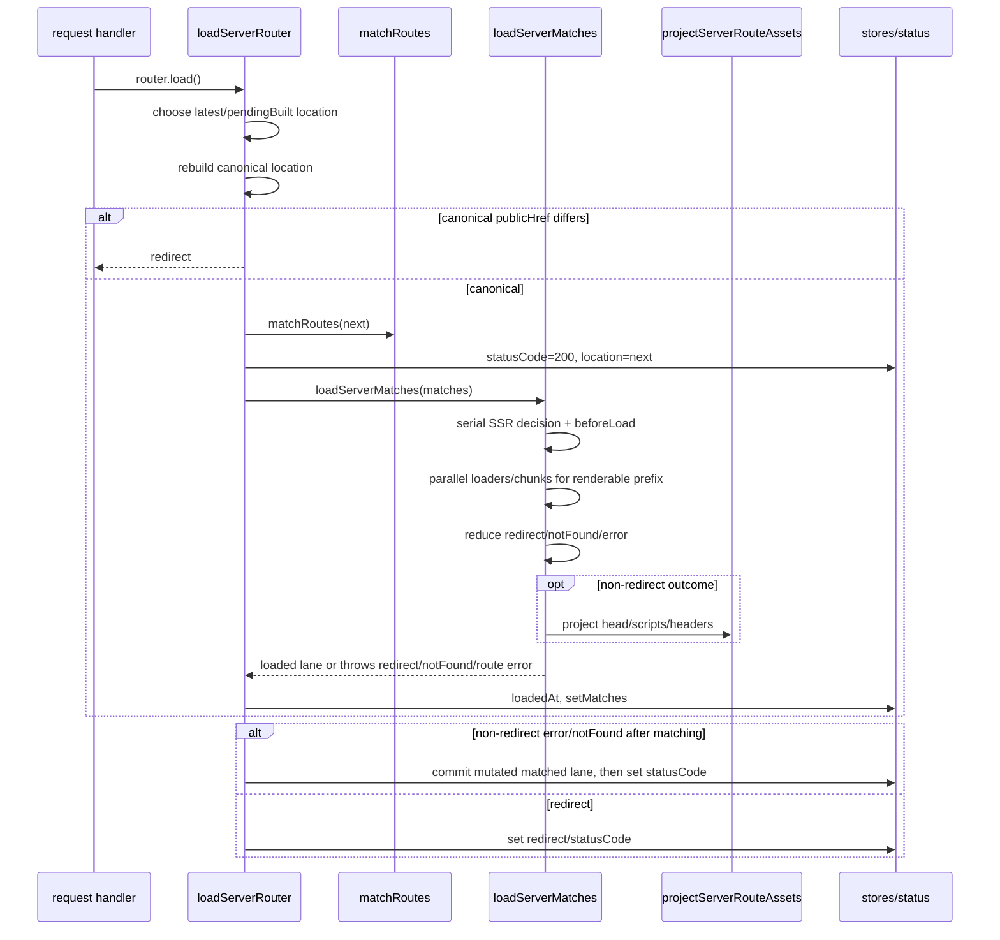

Server beforeLoad differs from client beforeLoad:

- It also computes SSR eligibility (`true`, `false`, or `data-only`).
- `ssr: false` skips server beforeLoad, loader, and route-chunk work for that
  match.
- `data-only` still runs server beforeLoad and loader work, but skips route
  chunk loading.
- Shell mode only SSR-loads the root.
- Parent `ssr: false` forces descendants to `ssr: false`.
- Preload is always false in server loader context.

Server route failure handling:

- Redirects update response redirect metadata and status code.
- For non-redirect errors and notFounds, `loadServerMatches()` mutates and
  trims the matched lane before throwing; `loadServerRouter()` commits that lane
  from its catch path and then derives the final status code.
- notFound commits the selected boundary. Non-root boundaries use
  `status: 'notFound'`; root/global notFound uses `globalNotFound: true`, and
  server status later becomes 404.
- Committed regular route errors use `status: 'error'` and later set status
  code 500.
- Lane trimming mirrors client behavior, but without pending/currentness
  machinery.

## Hydration Handoff

Hydration is a one-shot client path in `src/ssr/ssr-client.ts`. It keeps SSR
hydration reconstruction out of normal client match loading. The normal client
loader only retains a minimal dehydrated fast path for the fallback case where
hydration still needs to call `router.load()`.

Hydration flow:

1. Read `window.$_TSR.router`.
2. Install serialization adapters and SSR manifest.
3. Run custom `router.options.hydrate()` before matching routes.
4. Match the current client location.
5. Copy dehydrated status, data, errors, `ssr`, `updatedAt`, beforeLoad
   context, and `globalNotFound` when present into matching client matches.
   Mark unmatched client matches as `ssr: false`.
6. Mark matches as dehydrated unless `ssr === false`.
7. Start route chunk loading while copying those match payloads.
8. Publish initial matches.
9. Wait for route chunks before reconstructing route context and assets. Lazy
   chunks can install route context, head, scripts, and `ssr` options.
10. Restore `route.options.ssr = match.ssr` during the reconstruction pass, then
    rerun route context and execute head/scripts for the hydration lane.
11. If there are no `ssr: false` matches and this is not SPA mode, clear
    dehydrated markers, settle load promises, set `resolvedLocation`, and stop.
12. Otherwise call normal `router.load()` to fill SPA or `ssr: false` holes.

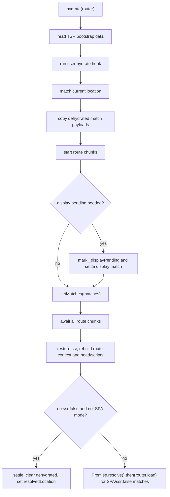

Hydration display pending uses `_displayPending`, not the normal client pending
timer. It applies to the SPA fallback match, or to the first non-fully-rendered
match (`ssr: false` or `data-only`) when pending UI/minimum timing applies. It
is cleared only after route chunks/context/head/scripts work, any required
`pendingMinMs`, and any follow-up SPA/`ssr:false` client load has left that
display match's pending state. If the marker is still present on a pending match
while the router is loading, hydration waits for `router.latestLoadPromise` and
tries again. After the follow-up load, hydration also repairs a still-pending
router status by setting `status: 'idle'` and `resolvedLocation` to the current
location; this covers synchronous loads that finish before framework
transitioners can observe them. Hydration failure cleanup settles matches and
clears the marker early.

## Route Outcome Ordering

When several route tasks settle, reduction order matters.

Foreground client loader reduction:

- Redirect throws immediately and wins.
- notFound is remembered if no redirect wins.
- The first unhandled non-route-control rejection is thrown.
- If no fatal rejection wins, notFound commits its boundary or root/global state
  and trims descendants.
- If an error match was committed, descendants after `badIndex` are removed.

Background reduction:

- Waits for all selected background loaders.
- Redirect wins.
- If no redirect wins, the shallowest regular error wins.
- If there is no regular error, the first selected notFound wins.

Server reduction:

- Waits for all renderable-prefix promises.
- Redirect wins.
- Redirects throw before server asset projection.
- If no fatal rejection wins, notFound can commit its selected boundary.
- Committed route errors trim to `badIndex`, project assets, and then throw the
  committed `errorMatch.error`.
- Unhandled fatal rejections throw after asset projection, but may not have a
  committed error match.

## Why Lanes Are Private First

Most match loading work mutates a private lane before publication. This gives
the router a place to build a coherent result while async work interleaves.

Private lanes let us:

- Run beforeLoad serially and loaders in parallel.
- Keep background data private until all selected loaders and assets are
  coherent.
- Publish pending UI without running final lifecycle hooks.
- Trim descendants after error/notFound without temporarily exposing invalid
  active state.
- Let preloads borrow active matches without owning or caching them.
- Abandon stale async work by throwing a private sentinel.

The rule of thumb:

> Async route work may mutate only the private lane it owns. It may publish only
> after proving it is still current.

## Common Change Checklist

When changing match loading, check these invariants:

- Does every async foreground/background continuation prove currentness before
  mutating or publishing?
- If a lane can be shortened, are removed matches' load promises settled?
- Does pending publication remain separate from final commit?
- Does route asset projection see the final coherent lane for that path?
- Does any client reload path that runs a loader write `loaderData`, including
  `undefined`, so a reload can clear previous data?
- Does cache mutation happen through cache APIs instead of `updateMatch()`?
- Can preload projection or caching accidentally treat a borrowed active/pending
  match as owned?
- Can background work publish after a foreground navigation starts?
- Does a redirect bypass source head execution?
- Does notFound choose the same boundary on client and server?
- Are server-only status code and headers kept out of client-only paths?
- Do component/chunk failures replace the original route failure without
  recursively trying to load another boundary component?
- Are `pendingMs` and `pendingMinMs` both honored when pending UI renders?

Useful test anchors:

- `packages/router-core/tests/load.test.ts`
  - preload borrowing and owner disappearance tests
  - pending publication and pendingMinMs tests
  - background stale reload and superseding-token tests
  - loader-returning-undefined foreground/background client tests
  - client/server notFound boundary trimming tests
  - redirect ownership tests
  - route asset projection tests
- `packages/router-core/tests/hydrate.test.ts`
  - dehydrated match reconstruction tests
  - route-chunk-before-head hydration tests
  - display pending cleanup tests
