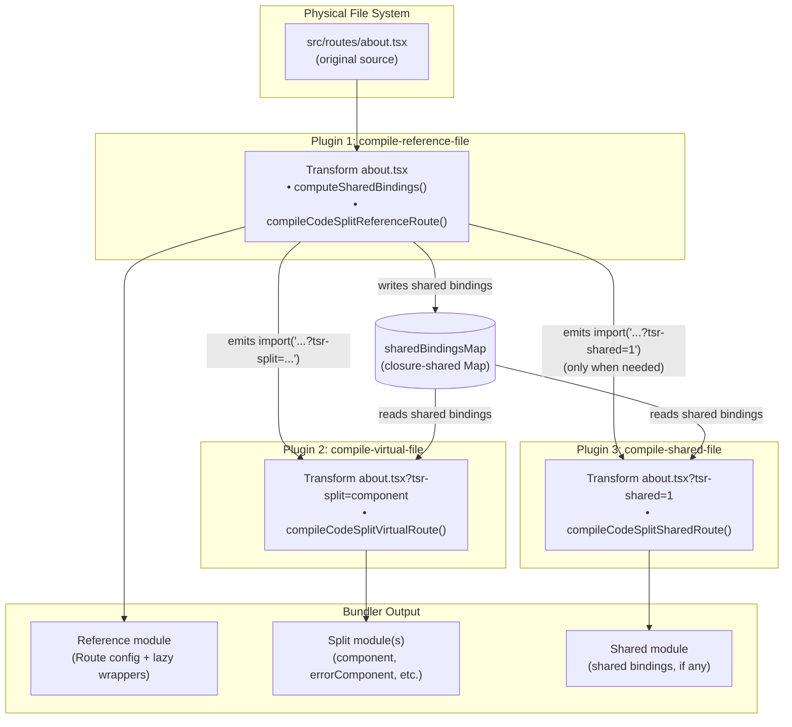
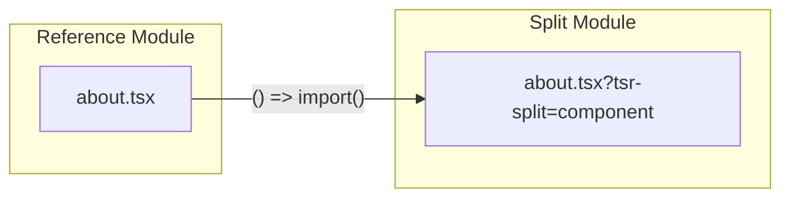
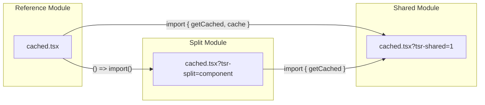
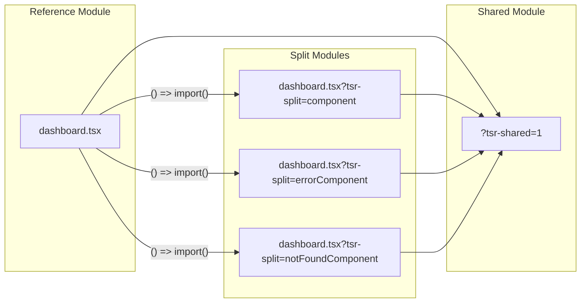
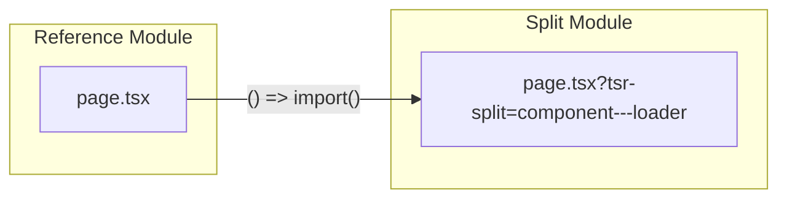

# Automatic Code-Splitting Architecture

> Internal documentation for the TanStack Router code-splitting system.
> This covers the Babel-based transform pipeline that splits route files into
> lazily-loaded modules (typically separate chunks) at build time.

---

## Table of Contents

1. [Overview](#overview)
2. [Architecture Diagram](#architecture-diagram)
3. [Plugin Pipeline](#plugin-pipeline)
4. [Virtual File Mechanism](#virtual-file-mechanism)
5. [Shared Bindings System](#shared-bindings-system)
6. [Code Split Groupings](#code-split-groupings)
7. [Compiler Functions Reference](#compiler-functions-reference)
8. [Dead Code Elimination](#dead-code-elimination)
9. [Framework Support](#framework-support)
10. [Edge Cases and Gotchas](#edge-cases-and-gotchas)
11. [Module Graph Diagrams](#module-graph-diagrams)

---

## Overview

TanStack Router's automatic code-splitting transforms a single route file into
multiple modules at build time so that heavy route properties (components,
loaders) are loaded on demand rather than eagerly.

Given a route file like:

```tsx
// src/routes/about.tsx
import { createFileRoute } from '@tanstack/react-router'

export const Route = createFileRoute('/about')({
  loader: () => fetchAboutData(),
  component: () => <div>About page</div>,
})
```

The plugin produces up to three modules from the **same physical file**:

| Module                                    | What it contains                                                                                                                                                                                       |
| ----------------------------------------- | ------------------------------------------------------------------------------------------------------------------------------------------------------------------------------------------------------ |
| `about.tsx` (reference)                   | Route config with `component` replaced by `lazyRouteComponent($$splitComponentImporter, 'component')` and an injected `const $$splitComponentImporter = () => import('about.tsx?tsr-split=component')` |
| `about.tsx?tsr-split=component` (virtual) | Only the component function, exported as `component`                                                                                                                                                   |
| `about.tsx?tsr-shared=1` (shared)         | Optional; created only when bindings are shared between split and non-split properties                                                                                                                 |

The bundler (Vite, Webpack, Rspack) treats query-parameterized imports as
distinct modules, so `about.tsx` and `about.tsx?tsr-split=component` are
separate entries in the module graph — each transformed differently by the
corresponding plugin.

### Why This Exists

Without code-splitting, every route's component tree ships in the initial
bundle. For large applications with dozens of routes, this means megabytes
of JavaScript the user downloads but never executes until they navigate to
that specific route. Automatic code-splitting solves this by:

1. Replacing component/loader values with lazy wrappers (dynamic `import()`)
2. Stripping the original implementations via dead-code elimination
3. Producing separate modules (typically separate chunks) the bundler can load on demand

---

## Architecture Diagram



---

## Plugin Pipeline

`unpluginRouterCodeSplitterFactory` (in `router-code-splitter-plugin.ts`)
returns an **array of 3 plugins** that share a closure containing:

- `sharedBindingsMap: Map<string, Set<string>>` — maps normalized file paths
  to their computed shared binding names
- `userConfig` — resolved plugin configuration
- Helper functions for grouping resolution

### Plugin 1: `tanstack-router:code-splitter:compile-reference-file`

**Filter:** File IDs matching `/\.(m|c)?(j|t)sx?$/` whose code contains one of
`createFileRoute(`, `createRootRoute(`, or `createRootRouteWithContext(`.
Excludes file IDs that include `tsr-split` or `tsr-shared`.

**What it does:**

1. Detects per-route `codeSplitGroupings` if specified inline
2. Calls `computeSharedBindings()` and caches the result in `sharedBindingsMap`
3. Calls `compileCodeSplitReferenceRoute()` which:
   - Replaces split properties with `lazyRouteComponent()` / `lazyFn()` wrappers
   - Injects `import()` expressions pointing to `?tsr-split=<encoded>` URLs
   - Removes shared binding declarations, replacing them with
     `import { ... } from '...?tsr-shared=1'`
   - Re-exports any user-exported shared bindings via
     `export { ... } from '...?tsr-shared=1'`
   - Runs dead-code elimination
   - Optionally appends HMR handling code (dev mode)

**Vite hooks:**

- `configResolved`: Validates plugin ordering (router must come before JSX
  transformation plugins like `@vitejs/plugin-react`)
- `applyToEnvironment`: Scopes the plugin to a specific Vite environment when
  `plugin.vite.environmentName` is configured (needed for TanStack Start which
  creates separate client/SSR plugin instances)

### Plugin 2: `tanstack-router:code-splitter:compile-virtual-file`

**Filter:** File IDs containing `tsr-split`.

**What it does:**

1. Extracts the grouping from the `?tsr-split=<encoded>` query parameter
2. Decodes it via `decodeIdentifier()` to get the list of properties this
   virtual file should export (e.g., `['component']`)
3. Reads shared bindings from `sharedBindingsMap` for the base file
4. Calls `compileCodeSplitVirtualRoute()` which:
   - Removes shared binding declarations before traversal (prevents scope
     collision crashes)
   - Keeps only the intended split properties as named exports
   - Converts user-exported declarations to imports from the base file
   - Adds `import { ... } from '...?tsr-shared=1'` if shared bindings exist
   - Runs dead-code elimination
   - Strips orphaned expression statements

**Vite hooks:**

- `applyToEnvironment`: Same environment scoping behavior as the reference
  plugin.

### Plugin 3: `tanstack-router:code-splitter:compile-shared-file`

**Filter:** File IDs containing `tsr-shared`.

**What it does:**

1. Extracts the base file path from the ID
2. Looks up shared bindings from `sharedBindingsMap`
3. Calls `compileCodeSplitSharedRoute()` which:
   - Keeps only declarations of shared bindings and their transitive
     dependencies
   - Strips `export` wrappers from kept declarations
   - Adds a single `export { ... }` statement for all shared bindings
   - Runs dead-code elimination to remove unused imports

**Vite hooks:**

- `applyToEnvironment`: Same environment scoping behavior as the reference
  plugin.

---

## Virtual File Mechanism

The system does **not** create actual virtual files. Instead, it leverages
the fact that bundlers (Vite, Webpack, Rspack) treat the same physical file
with different query parameters as distinct module IDs:

```
src/routes/about.tsx                        → Module A (reference)
src/routes/about.tsx?tsr-split=component    → Module B (virtual/split)
src/routes/about.tsx?tsr-shared=1           → Module C (shared)
```

All three modules start from the **same source code** — the bundler reads the
physical file each time. Each plugin's `transform` filter matches on different
query parameters, so each module gets a different transformation applied.

### Path ID Encoding

The `?tsr-split` query parameter value is an encoded representation of the
split grouping. The encoding (in `path-ids.ts`) works as follows:

1. Sort the property names alphabetically (grouping order is not preserved)
2. Join with `---` delimiter
3. Replace unsafe URL characters with safe tokens:
   - `/` → `--slash--`
   - `?` → `--question--`
   - `#` → `--hash--`
   - etc.

For example, a grouping of `['component']` becomes `?tsr-split=component`.
A combined grouping of `['component', 'errorComponent']` becomes
`?tsr-split=component---errorComponent`.

The decoding is the inverse: `decodeIdentifier()` reverses the token
replacements and splits on `---`.

Note: this encoding is not a general-purpose reversible scheme (it maps spaces
to `_` and decodes `_` back to spaces). It's safe here because split grouping
strings are known route option keys like `component` and `loader`.

### Resolution Flow

When the reference compiler emits:

```js
const $$splitComponentImporter = () => import('about.tsx?tsr-split=component')
```

The bundler:

1. Resolves `about.tsx?tsr-split=component` to the physical file `about.tsx`
   with the query parameter preserved
2. Reads the source of `about.tsx`
3. Runs the transform pipeline — Plugin 2 matches (`tsr-split` in ID) and
   transforms it into a module that exports only `component`
4. The result is a separate module in the output graph (often a separate chunk, depending on bundler chunking)

---

## Shared Bindings System

### The Problem

Consider a route file with a module-level variable used by both the `loader`
(non-split by default) and the `component` (split by default):

```tsx
const cache = new Map()
function getCached(key: string) {
  return cache.get(key)
}
function setCached(key: string, val: unknown) {
  cache.set(key, val)
}

export const Route = createFileRoute('/cached')({
  loader: async () => {
    setCached('data', await fetch('/api').then((r) => r.json()))
    return getCached('data')
  },
  component: () => <div>{JSON.stringify(getCached('data'))}</div>,
})
```

Without the shared bindings system, `cache` and `getCached` would be
**duplicated** — one copy in the reference module (used by `loader`) and another
in the split component module. Each would have its own `Map` instance, so
`setCached` in the loader would write to a different map than `getCached` in
the component reads from. This is a **correctness bug**, not just a bundle
size issue.

### The Solution

`computeSharedBindings()` identifies bindings that are referenced by properties
in 2+ distinct "groups" (where each split grouping index is one group, and all
non-split properties form group `-1`). These bindings are extracted into a
third virtual module (`?tsr-shared=1`) that both the reference module and the
split modules import from, ensuring a single shared instance.

### How `computeSharedBindings()` Works

**Location:** `src/core/code-splitter/compilers.ts` (`computeSharedBindings`)

**Algorithm:**

1. **Collect local bindings** — Cheap loop over `program.body` to find all
   module-level `const`/`let`/`var`/`function`/`class` declarations. Deletes
   `Route` from the set (must never be extracted). If no local bindings
   remain, returns empty set immediately (fast path).

2. **Find route options** — Uses `babel.traverse` to locate the
   `createFileRoute('/')({ ... })` call and extract the options object.

3. **Fast path: group count check** — Iterates over route option properties,
   tracking whether any non-split properties exist, and counting distinct
   split group indices.
   - If there are no non-split properties and fewer than 2 split groups are
     present, nothing can be shared and it returns an empty set.

4. **Build dependency graph** — `buildDependencyGraph()` creates a map from
   each local binding to the set of other local bindings it references. Uses
   `collectIdentifiersFromNode()` (a fast recursive walker, much cheaper than
   `babel.traverse`) for each declaration.

5. **Attribute bindings to groups** — For each route option property:
   - Collects direct module-level references from the property value
   - Expands transitively via the dependency graph (BFS)
   - Records which group index each binding belongs to

6. **Identify shared bindings** — Any binding appearing in 2+ distinct groups
   is shared.

7. **Handle destructured declarators** — If bindings from the same
   `const { a, b } = fn()` appear in different groups, the entire declarator
   must be shared (can't split the initialization).

8. **Expand destructured declarations** — If any binding in a destructured
   pattern is shared, all bindings in that pattern must be shared.

9. **Remove Route-dependent bindings** — `removeBindingsDependingOnRoute()`
   builds a reverse dependency graph, walks backwards from `Route` via BFS,
   and removes any shared binding that transitively depends on `Route`. This
   prevents Route duplication in the shared module.

### Concrete Example

**Input** (`shared-function.tsx`):

```tsx
import { createFileRoute } from '@tanstack/react-router'

const cache = new Map()
function getCached(key: string) {
  return cache.get(key)
}
function setCached(key: string, val: unknown) {
  cache.set(key, val)
}

export const Route = createFileRoute('/cached')({
  loader: async () => {
    setCached('data', await fetch('/api').then((r) => r.json()))
    return getCached('data')
  },
  component: () => <div>{JSON.stringify(getCached('data'))}</div>,
})
```

**Analysis:**

- `loader` is non-split (group `-1`), references: `setCached`, `getCached`
- `component` is split (group `0`), references: `getCached`
- `getCached` appears in groups `-1` and `0` → **shared**
- `getCached` depends on `cache` → `cache` is transitively shared
- `setCached` appears only in group `-1` → **not shared**

**Output — Reference file** (`shared-function.tsx`):

```tsx
import { getCached, cache } from 'shared-function.tsx?tsr-shared=1'
const $$splitComponentImporter = () =>
  import('shared-function.tsx?tsr-split=component')
import { lazyRouteComponent } from '@tanstack/react-router'
import { createFileRoute } from '@tanstack/react-router'
function setCached(key: string, val: unknown) {
  cache.set(key, val)
}
export const Route = createFileRoute('/cached')({
  loader: async () => {
    setCached('data', await fetch('/api').then((r) => r.json()))
    return getCached('data')
  },
  component: lazyRouteComponent($$splitComponentImporter, 'component'),
})
```

**Output — Split module** (`shared-function.tsx?tsr-split=component`):

```tsx
import { getCached } from 'shared-function.tsx?tsr-shared=1'
const SplitComponent = () => <div>{JSON.stringify(getCached('data'))}</div>
export { SplitComponent as component }
```

**Output — Shared module** (`shared-function.tsx?tsr-shared=1`):

```tsx
const cache = new Map()
function getCached(key: string) {
  return cache.get(key)
}
export { cache, getCached }
```

Note how `setCached` is **not** in the shared module — it's only used by
`loader` (non-split), so it stays in the reference file. The reference file
imports `cache` (needed by `setCached`) from the shared module.

### Cross-Plugin Communication

The three plugins share a closure containing `sharedBindingsMap`:

```
Plugin 1 (reference): computeSharedBindings() → sharedBindingsMap.set(id, bindings)
Plugin 2 (virtual):   sharedBindingsMap.get(baseId) → pass to compileCodeSplitVirtualRoute()
Plugin 3 (shared):    sharedBindingsMap.get(baseId) → pass to compileCodeSplitSharedRoute()
```

This works because all three plugins run in the same JavaScript process and
the map is captured by closure. In typical builds, the reference module is
transformed first and then the bundler resolves the emitted dynamic imports,
which triggers transformations for the virtual/shared module IDs.

---

## Code Split Groupings

### Default Groupings

Defined in `constants.ts`:

```ts
export const defaultCodeSplitGroupings: CodeSplitGroupings = [
  ['component'], // group 0 → separate module ID (often a separate chunk)
  ['errorComponent'], // group 1 → separate module ID (often a separate chunk)
  ['notFoundComponent'], // group 2 → separate module ID (often a separate chunk)
]
```

**Important:** `loader` is **not** split by default. It stays in the reference
file alongside non-split properties like `beforeLoad`, `validateSearch`,
`context`, etc.

### Splittable Properties

Only these 5 properties can be split (defined in `splitRouteIdentNodes`):

- `loader`
- `component`
- `pendingComponent`
- `errorComponent`
- `notFoundComponent`

Any property not in `splitRouteIdentNodes` is never split, regardless of
configuration.

### How Groupings Work

Each array within the groupings array represents one split module ID.
Properties in the same inner array end up in the same split module:

```ts
// Default: 3 separate split module IDs (often 3 separate chunks)
;[['component'], ['errorComponent'], ['notFoundComponent']][
  // Combined: component + loader in one module, error in another
  (['component', 'loader'], ['errorComponent'])
][
  // All in one module
  ['component', 'loader', 'errorComponent', 'notFoundComponent']
]
```

### Configuring Groupings

There are three levels of configuration, applied with this priority:

1. **Per-route inline** (highest priority):

   ```tsx
   export const Route = createFileRoute('/about')({
     codeSplitGroupings: [['component', 'loader']],
     component: ...,
     loader: ...,
   })
   ```

2. **Per-route via plugin** (`splitBehavior` callback):

   ```ts
   tanstackRouter({
     codeSplittingOptions: {
       splitBehavior: ({ routeId }) => {
         if (routeId === '/dashboard') return [['component', 'loader']]
         return undefined // use default
       },
     },
   })
   ```

3. **Global default** (`defaultBehavior`):
   ```ts
   tanstackRouter({
     codeSplittingOptions: {
       defaultBehavior: [['component', 'loader'], ['errorComponent']],
     },
   })
   ```

### `findIndexForSplitNode()`

This function determines which group a property belongs to:

```ts
function findIndexForSplitNode(str: string) {
  return opts.codeSplitGroupings.findIndex((group) =>
    group.includes(str as any),
  )
}
```

Returns the group index (`0`, `1`, `2`, ...) for split properties, or `-1`
for properties not in any group (non-split properties like `beforeLoad`,
`validateSearch`, `context`, etc.).

The group index `-1` is treated as its own group in the shared bindings
computation — it represents "stays in the reference file."

---

## Compiler Functions Reference

All compiler functions live in `compilers.ts`.

### `compileCodeSplitReferenceRoute()`

**Purpose:** Transform the original route file into the "reference" module.

**Input:** Original source code, split groupings, framework target, options.

**Output:** Modified source where split properties are replaced with lazy
wrappers, shared bindings are replaced with imports, and dead code is
eliminated.

**Key steps:**

1. Parse AST, collect `findReferencedIdentifiers()` for DCE
2. For each split-able property in route options:
   - Check if the value is exported (if so, skip splitting — warn user)
   - Generate a dynamic import URL: `addSplitSearchParamToFilename()`
   - Create importer: `const $$splitComponentImporter = () => import('...')`
   - Replace property value with `lazyRouteComponent(importer, 'component')`
     or `lazyFn(importer, 'loader')`
3. Remove unused import paths
4. If shared bindings exist:
   - Remove shared declarations from AST
   - Add `import { ... } from '...?tsr-shared=1'`
   - Re-export user-exported shared bindings
5. Run `deadCodeElimination()`
6. Generate output code with source maps

### `compileCodeSplitVirtualRoute()`

**Purpose:** Transform a copy of the route file into a split module that
exports only specific properties.

**Input:** Original source code, split targets (e.g., `['component']`),
shared bindings set.

**Output:** A module that exports only the intended properties.

**Key steps:**

1. Parse AST, collect referenced identifiers
2. **Remove shared declarations first** (before `babel.traverse`) — critical
   to avoid `checkBlockScopedCollisions` crashes
3. Track split-able nodes and their metadata
4. For each intended split target:
   - Resolve the property value through bindings
   - Create a named export (e.g., `export { SplitComponent as component }`)
5. Convert remaining user exports to imports from the base file
6. Add shared bindings import if applicable
7. Run `deadCodeElimination()`
8. Strip orphaned expression statements
9. Generate output with source maps

### `compileCodeSplitSharedRoute()`

**Purpose:** Produce the shared virtual module containing only the shared
binding declarations.

**Input:** Original source code, set of shared binding names.

**Output:** A module that declares and exports only shared bindings and their
transitive dependencies.

**Key steps:**

1. Parse AST, collect referenced identifiers
2. Build dependency graph, expand shared bindings transitively
3. Filter `program.body` to keep only:
   - Import declarations (DCE removes unused ones)
   - Declarations of bindings in the keep set
4. Strip `export` wrappers from kept declarations
5. Add `export { ... }` for all shared bindings
6. Run `deadCodeElimination()`
7. Generate output with source maps

### `computeSharedBindings()`

**Purpose:** Analyze a route file to determine which module-level bindings
are referenced by multiple split groups.

See [Shared Bindings System](#shared-bindings-system) for the full algorithm.

### `detectCodeSplitGroupingsFromRoute()`

**Purpose:** Parse inline `codeSplitGroupings` from route options.

Traverses the AST looking for a `codeSplitGroupings` property on the route
options object (supports both `createFileRoute` and `createRoute` call sites).
If found, extracts the array-of-arrays value and returns it.

### Helper Functions

| Function                                | Purpose                                                                                                        |
| --------------------------------------- | -------------------------------------------------------------------------------------------------------------- |
| `collectIdentifiersFromNode()`          | Fast recursive walker to collect referenced identifier names from any AST node. Cheaper than `babel.traverse`. |
| `buildDeclarationMap()`                 | Maps binding name → AST declaration node for all module-level declarations.                                    |
| `buildDependencyGraph()`                | Maps binding name → set of other local bindings it references.                                                 |
| `expandTransitively()`                  | BFS expansion of a set through a dependency graph.                                                             |
| `removeBindingsDependingOnRoute()`      | Reverse-graph BFS from `Route` to find and remove dependents.                                                  |
| `expandDestructuredDeclarations()`      | If any binding in a destructured pattern is shared, mark all as shared.                                        |
| `expandSharedDestructuredDeclarators()` | If bindings from same declarator appear in different groups, mark declarator as shared.                        |
| `collectLocalBindingsFromStatement()`   | Collects locally-declared names from a statement (cheap, no traversal).                                        |
| `collectModuleLevelRefsFromNode()`      | Intersects `collectIdentifiersFromNode()` with local module-level bindings.                                    |
| `removeSharedDeclarations()`            | Filters shared binding declarations out of `program.body`.                                                     |
| `findExportedSharedBindings()`          | Finds which shared bindings have `export` in the original source.                                              |

---

## Dead Code Elimination

After each compiler transforms the AST, it runs `deadCodeElimination()` from
`@tanstack/router-utils`. This is critical because:

- The reference file no longer uses the component implementation (it was
  replaced with a lazy wrapper), so the original component code and its
  dependencies should be stripped.
- The virtual file only exports specific properties, so everything else
  (loader, beforeLoad, other components) should be stripped.
- The shared file only keeps shared bindings, so everything else should be
  stripped.

### How It Works

1. **`findReferencedIdentifiers(ast)`** — Collects all `Identifier` NodePaths
   in the AST that are in a "referenced" position (not binding sites). Returns
   a `Set<NodePath>`.

2. **`deadCodeElimination(ast, refIdents)`** — Iterates over all bindings in
   the program scope. For each binding, checks whether any of its references
   are in `refIdents`. If not, the binding is unreferenced and its declaration
   is removed. Repeats until no more bindings can be removed (handles chains
   where removing one binding makes another unreferenced).

### Import Registration for DCE

When the compilers add new imports (for shared bindings, or convert exports
to imports in virtual files), they must register the import specifier locals
in `refIdents` so DCE can later decide whether to keep or remove them:

```ts
sharedImportPath.traverse({
  Identifier(identPath) {
    if (identPath.parentPath.isImportSpecifier() && identPath.key === 'local') {
      refIdents.add(identPath)
    }
  },
})
```

Without this, DCE would have no path references for the new imports and would
always remove them.

### Post-DCE Cleanup in Virtual Files

DCE only removes unused **declarations**. Bare side-effect statements like
`console.log(...)` survive even when no locally-bound names reference them.
The virtual compiler has an additional cleanup pass:

```ts
ast.program.body = ast.program.body.filter((stmt) => {
  if (!t.isExpressionStatement(stmt)) return true
  const refs = collectIdentifiersFromNode(stmt)
  return [...refs].some((name) => locallyBound.has(name))
})
```

This strips expression statements that don't reference any locally-bound name.

### Directive Prologue Handling

If the file body is empty after DCE (virtual file where no properties matched),
directive prologues (`'use client'`, `'use strict'`) are also stripped:

```ts
if (ast.program.body.length === 0) {
  ast.program.directives = []
}
```

---

## Framework Support

The code-splitting system is framework-agnostic at the Babel transform level.
Framework differences are confined to `framework-options.ts`:

| Framework | Package                  | `createFileRoute` | `lazyFn` | `lazyRouteComponent` |
| --------- | ------------------------ | ----------------- | -------- | -------------------- |
| React     | `@tanstack/react-router` | `createFileRoute` | `lazyFn` | `lazyRouteComponent` |
| Solid     | `@tanstack/solid-router` | `createFileRoute` | `lazyFn` | `lazyRouteComponent` |
| Vue       | `@tanstack/vue-router`   | `createFileRoute` | `lazyFn` | `lazyRouteComponent` |

Currently all frameworks use the same identifier names. The framework option
is used to determine which package to import `lazyRouteComponent` and `lazyFn`
from.

### Plugin Order Validation (Vite only)

The reference plugin's `configResolved` hook checks that the TanStack Router
plugin appears **before** JSX transformation plugins in the Vite config. This
is required because the code-splitter must transform the source before JSX
is compiled away. Validated plugins:

- **React:** `@vitejs/plugin-react` (Babel), `@vitejs/plugin-react-swc` (SWC),
  `@vitejs/plugin-react-oxc` (OXC)
- **Solid:** `vite-plugin-solid`

If the order is wrong, the plugin throws an error with a suggested fix.

### Environment Scoping

When `userConfig.plugin?.vite?.environmentName` is set, all three plugins use
`applyToEnvironment` to restrict themselves to that specific Vite environment.
This is necessary for TanStack Start, which creates separate plugin instances
for client and SSR environments.

---

## Edge Cases and Gotchas

### 1. Exported Identifiers Are Not Split

If a value for a splittable route option is exported from the route file
(e.g. `export const MyComp = ...` used as `component: MyComp`), the plugin
**skips** splitting it. The value stays in the reference file and a warning is
emitted:

```
[tanstack-router] These exports from "about.tsx" will not be code-split and will increase your bundle size:
- MyComp
For the best optimization, these items should either have their export statements removed, or be imported from another location that is not a route file.
```

This is because other modules may import `MyComp` directly, and splitting it
would break those imports. (In dev, the warning is also injected into the
compiled output as a `console.warn` to make it obvious during local testing.)

### 2. Root Routes Are Never Split

`createRootRoute()` and `createRootRouteWithContext()` are in
`unsplittableCreateRouteFns`. The reference compiler adds HMR handling but
exits before attempting any code-splitting transforms.

### 3. `undefined`, `null`, and `boolean` Values Are Kept In-Place

Properties with these literal values are not split:

```tsx
createFileRoute('/about')({
  component: undefined, // kept in reference
  errorComponent: false, // kept in reference
  notFoundComponent: null, // kept in reference
})
```

These represent "fall back to parent route" semantics and must not be moved.

### 4. Destructured Declarations Must Be Shared Atomically

```tsx
const { a, b } = createHelpers()
```

If `a` is used by `component` (split) and `b` is used by `loader` (non-split),
the entire `const { a, b } = createHelpers()` declaration must go to the
shared module. You can't split the initialization — calling `createHelpers()`
twice would be incorrect.

### 5. Route-Dependent Bindings Cannot Be Shared

```tsx
const routePath = Route.fullPath
function useRouteStuff() {
  return routePath
}
```

Even if `useRouteStuff` is referenced by multiple groups, it cannot be
extracted to the shared module because it depends on `Route`. Extracting it
would require `Route` in the shared module, duplicating the route singleton.
`removeBindingsDependingOnRoute()` handles this via reverse-graph BFS.

### 6. `removeSharedDeclarations` Must Run Before `babel.traverse` in Virtual Files

In `compileCodeSplitVirtualRoute()`, shared declarations are removed
**before** `babel.traverse` runs:

```ts
if (opts.sharedBindings && opts.sharedBindings.size > 0) {
  removeSharedDeclarations(ast, opts.sharedBindings)
}

babel.traverse(ast, { ... })
```

If done after, Babel's scope analysis would see both the shared declaration
and the new shared import, causing a `checkBlockScopedCollisions` crash
(duplicate `const` binding in the same scope).

### 7. Directive Prologues Survive Code-Splitting

Babel stores directives (like `'use client'`) in `program.directives`, not
in `program.body`. They are preserved through all transforms automatically.
The only exception is when the body is completely empty after DCE — then
directives are stripped too (a file with just `'use client'` and no code is
useless).

### 8. Plugin Ordering in the Array Matters

The 3 plugins must be returned in order: reference, virtual, shared. The
reference plugin populates `sharedBindingsMap` before the other two consume
it. Bundlers process transforms in plugin array order for a given module ID.

### 9. Imported Bindings Are Never Shared

`computeSharedBindings()` only considers **locally-declared** module-level
bindings. Import statements are handled by the bundler's module system — if
both the reference file and a virtual file import the same external module,
the bundler deduplicates that import automatically. No shared module needed.

### 10. `SPLIT_NODES_CONFIG` — Split Strategy per Property

Each splittable property has a configured split strategy:

| Property            | Strategy             | Wrapper                                     |
| ------------------- | -------------------- | ------------------------------------------- |
| `component`         | `lazyRouteComponent` | Wraps with Suspense-compatible lazy loading |
| `pendingComponent`  | `lazyRouteComponent` | Same                                        |
| `errorComponent`    | `lazyRouteComponent` | Same                                        |
| `notFoundComponent` | `lazyRouteComponent` | Same                                        |
| `loader`            | `lazyFn`             | Wraps as a lazy function call               |

Components use `lazyRouteComponent` (framework-provided). In React this
integrates with Suspense-compatible lazy loading. Loaders use `lazyFn` which
wraps the async function for deferred loading.

### 11. Source Maps Are Preserved

All three compilers pass `sourceMaps: true` and `sourceFileName` to
`generateFromAst()`, ensuring the browser's devtools can map back to the
original source file.

---

## Module Graph Diagrams

### Simple Route (No Shared Bindings)



When the route has no module-level bindings shared between split and non-split
properties, there is no shared module. The reference module has a dynamic
import to the split module.

### Route With Shared Bindings



The shared module is imported synchronously by both the reference module and
the split module. Bundlers will usually dedupe this to a single module instance;
whether it becomes a separate chunk or gets inlined into another chunk depends
on the bundler's chunking strategy.

### Route With Multiple Split Groups



Each split group gets its own split module. If a binding is shared across any
two of these (or between a split module and the reference module), it lives in
the shared module.

### Combined Groupings



When `component` and `loader` are in the same grouping
(`[['component', 'loader']]`), they end up in a single split module. This
reduces the number of split modules (and likely requests) at the cost of
loading the loader even when only the component is needed (and vice versa).

---

## Key Source Files

| File                                          | Description                                                                  |
| --------------------------------------------- | ---------------------------------------------------------------------------- |
| `src/core/router-code-splitter-plugin.ts`     | Plugin factory — creates 3 plugins, manages `sharedBindingsMap`              |
| `src/core/code-splitter/compilers.ts`         | All compiler functions (~1,970 lines)                                        |
| `src/core/constants.ts`                       | `tsrSplit`, `tsrShared`, `splitRouteIdentNodes`, `defaultCodeSplitGroupings` |
| `src/core/code-splitter/framework-options.ts` | Per-framework package/ident configuration                                    |
| `src/core/code-splitter/path-ids.ts`          | URL-safe encoding/decoding for split identifiers                             |
| `src/core/config.ts`                          | Plugin configuration types and validation                                    |
| `src/core/route-hmr-statement.ts`             | HMR handling code template                                                   |
| `tests/code-splitter/`                        | Unit tests and snapshot fixtures                                             |
