# Router Store Split Findings

## Scope

Goal: replace the single router `__store` with granular stores so adapter hooks/components subscribe only to what they actually need.

Requested model:

- 1 store per match
- 1 store per `RouterState` property
- derived stores for utilities

This document inventories every relevant consumer in React, Solid, and Vue adapters and maps those consumers to required primitive/derived stores.

## Current State Shape (source of truth today)

`RouterState` currently includes:

- `status`
- `loadedAt`
- `isLoading`
- `isTransitioning`
- `matches`
- `pendingMatches`
- `cachedMatches`
- `location`
- `resolvedLocation`
- `statusCode`
- `redirect`

Defined in:

- `packages/router-core/src/router.ts`

## Proposed Store Graph

### Layer 0: Primitive stores

- `status$`
- `loadedAt$`
- `isLoading$`
- `isTransitioning$`
- `location$`
- `resolvedLocation$`
- `statusCode$`
- `redirect$`
- `currentMatchIds$` (ordered ids of active matches)
- `currentMatchIdSet$` (`Record<matchId, true>` for nearest-id presence checks)
- `currentMatchIdByRouteId$` (`Record<routeId, matchId>` for `from` resolution)
- `pendingMatchIds$` (ordered ids of pending matches)
- `pendingMatchIdByRouteId$` (`Record<routeId, matchId>` for transition-aware fallback)
- `cachedMatchIds$` (ordered ids of cached matches)
- `matchStoreById` (`Map<string, Store<AnyRouteMatch>>`, one store per match id)

### Layer 1: Structural derived stores

- `currentMatches$` from `currentMatchIds$ + matchStoreById`
- `pendingMatches$` from `pendingMatchIds$ + matchStoreById`
- `cachedMatches$` from `cachedMatchIds$ + matchStoreById`
- `currentMatchIndexById$`
- `firstCurrentMatchId$`
- `leafCurrentMatchId$`
- `childMatchIdByParentId$`
- `childMatchStatusByParentId$`
- `hasPendingCurrentMatch$` (any active match status is `pending`)

### Layer 2: Utility derived stores

- `resolveCurrentMatchId(...)` utility helper
  - Inputs are adapter-specific:
    - React: `currentMatchIdSet$`, `currentMatchIdByRouteId$`
    - Solid/Vue: plus `pendingMatchIdByRouteId$`, `isTransitioning$`
  - Resolve by nearest id or `routeId`
  - Adapter-aware behavior:
    - React: current match only, throw if missing (default)
    - Solid/Vue: tolerate missing current match when pending equivalent exists or transitioning
    - Vue additionally needs same-route stale-id fallback behavior in `Match`/`MatchInner`
- `matchRouteTrigger$` for `useMatchRoute` recomputation (`location`, `resolvedLocation`, `status`, and optionally `isLoading`)
- `notFoundResetKey$` from `location.pathname + status`
- `canGoBack$` from `location.state.__TSR_index !== 0`
- `onRenderedLocationKey$` from `resolvedLocation` state key used in adapter `OnRendered`
- `vueLinkFrom$` (`options.from ?? leafCurrentMatch.fullPath`)
- `headTagInputs$` family (meta/links/styles/scripts/headScripts inputs from active matches)
- `routerStateCompat$` (optional aggregate for backward-compatible `useRouterState(select full state)` behavior)

## Dependency Graph

```mermaid
graph TD
  subgraph L0["Primitive"]
    A1["status$"]
    A2["loadedAt$"]
    A3["isLoading$"]
    A4["isTransitioning$"]
    A5["location$"]
    A6["resolvedLocation$"]
    A7["statusCode$"]
    A8["redirect$"]
    A9["currentMatchIds$"]
    A10["currentMatchIdSet$"]
    A11["currentMatchIdByRouteId$"]
    A12["pendingMatchIds$"]
    A13["pendingMatchIdByRouteId$"]
    A14["cachedMatchIds$"]
    A15["matchStoreById (non-reactive Map)"]
  end

  subgraph L1["Structural Derived"]
    B1["currentMatches$"]
    B2["pendingMatches$"]
    B3["cachedMatches$"]
    B4["currentMatchIndexById$"]
    B5["firstCurrentMatchId$"]
    B6["leafCurrentMatchId$"]
    B7["childMatchIdByParentId$"]
    B8["childMatchStatusByParentId$"]
    B9["hasPendingCurrentMatch$"]
  end

  subgraph L2["Utility / Selector"]
    C1["resolveCurrentMatchId(...)"]
    C2["matchRouteTrigger$"]
    C3["notFoundResetKey$"]
    C4["canGoBack$"]
    C5["onRenderedLocationKey$"]
    C6["vueLinkFrom$"]
    C7["headTagInputs$"]
    C8["routerStateCompat$"]
  end

  subgraph L3["Consumers"]
    D1["useMatch family"]
    D2["useMatches family"]
    D3["Match/Matches/Outlet"]
    D4["useLocation/useCanGoBack/CatchNotFound"]
    D5["Link/useMatchRoute"]
    D6["Transitioner"]
    D7["HeadContent/Scripts"]
    D8["useRouterState"]
  end

  A9 --> B1
  A12 --> B2
  A14 --> B3
  A15 --> B1
  A15 --> B2
  A15 --> B3

  B1 --> B4
  B1 --> B5
  B1 --> B6
  B4 --> B7
  B1 --> B7
  B1 --> B8
  B1 --> B9

  A10 --> C1
  A11 --> C1
  A13 --> C1
  A4 --> C1
  A5 --> C2
  A6 --> C2
  A1 --> C2
  A3 --> C2
  A5 --> C3
  A1 --> C3
  A5 --> C4
  A6 --> C5
  B6 --> C6
  B1 --> C7
  A1 --> C8
  A2 --> C8
  A3 --> C8
  A4 --> C8
  A5 --> C8
  A6 --> C8
  A7 --> C8
  A8 --> C8
  B1 --> C8
  B2 --> C8
  B3 --> C8

  C1 --> D1
  B1 --> D2
  B4 --> D2
  B5 --> D3
  B7 --> D3
  B8 --> D3
  A2 --> D3
  C3 --> D4
  C4 --> D4
  A5 --> D4
  C2 --> D5
  A5 --> D5
  C6 --> D5
  A3 --> D6
  B9 --> D6
  C7 --> D7
  C8 --> D8
```



## Consumer Inventory By Adapter

### React adapter

Primary files:

- `packages/react-router/src/useMatch.tsx`
- `packages/react-router/src/Match.tsx`
- `packages/react-router/src/Matches.tsx`
- `packages/react-router/src/link.tsx`
- `packages/react-router/src/Transitioner.tsx`
- `packages/react-router/src/headContentUtils.tsx`
- `packages/react-router/src/Scripts.tsx`
- `packages/react-router/src/useLocation.tsx`
- `packages/react-router/src/useCanGoBack.ts`
- `packages/react-router/src/not-found.tsx`

Needs:

- `useMatch` and transitive hooks (`useParams`, `useSearch`, `useLoaderData`, `useLoaderDeps`, `useRouteContext`, plus route APIs): resolve current match by `routeId` or nearest id.
- `Match`/`Outlet`: parent/child lookups and selected match fields (`status`, `error`, `invalid`, `_forcePending`, `_displayPending`, `loaderDeps`, strict params/search, `routeId`).
- `Matches` root: first current match id + `loadedAt`.
- `useMatchRoute`: recompute when location/resolved/status change.
- `Link`: subscribe to current location/search/hash for active checks; search subscription for rebuilding `buildLocation`.
- `Transitioner`: `isLoading` + `hasPendingCurrentMatch`, then write `status=idle` and `resolvedLocation=location` on resolve.
- Head/Scripts: active matches + per-match head/script fields.

### Solid adapter

Primary files:

- `packages/solid-router/src/useMatch.tsx`
- `packages/solid-router/src/Match.tsx`
- `packages/solid-router/src/Matches.tsx`
- `packages/solid-router/src/link.tsx`
- `packages/solid-router/src/Transitioner.tsx`
- `packages/solid-router/src/headContentUtils.tsx`
- `packages/solid-router/src/Scripts.tsx`
- `packages/solid-router/src/useLocation.tsx`
- `packages/solid-router/src/useCanGoBack.ts`
- `packages/solid-router/src/not-found.tsx`

Needs:

- Same core as React plus transition-aware match resolution:
  - if current match missing, tolerate when matching pending entry exists or `isTransitioning` is true.
- `Outlet` also reads child status for not-found vs redirected behavior.
- `Match` handles temporary absence of current match during transitions (must not hard-throw in selector path).

### Vue adapter

Primary files:

- `packages/vue-router/src/useMatch.tsx`
- `packages/vue-router/src/Match.tsx`
- `packages/vue-router/src/Matches.tsx`
- `packages/vue-router/src/link.tsx`
- `packages/vue-router/src/Transitioner.tsx`
- `packages/vue-router/src/headContentUtils.tsx`
- `packages/vue-router/src/Scripts.tsx`
- `packages/vue-router/src/useLocation.tsx`
- `packages/vue-router/src/useCanGoBack.ts`
- `packages/vue-router/src/not-found.tsx`

Needs:

- Same core as Solid plus:
  - stale `matchId` handling in `Match`/`MatchInner` via `lastKnownRouteId` fallback (same-route transition where id changes).
  - `Link` default `from` derived from leaf current match fullPath.
- Transitioner writes `isTransitioning` in router state and also writes resolved idle status in several paths.

## Core Write Paths That Must Update New Stores

All of these currently mutate through `__store` and need equivalent granular updates:

- `beforeLoad` pending ingestion
- `load` commit (`onReady`) and cache rotation
- redirect/notFound/error status code updates
- `updateMatch`
- `invalidate`
- `clearCache` / `clearExpiredCache`
- `preloadRoute` cache insertion
- SSR client hydration updates

Key files:

- `packages/router-core/src/router.ts`
- `packages/router-core/src/load-matches.ts`
- `packages/router-core/src/ssr/ssr-client.ts`

## Compatibility Requirement

Even after splitting stores, adapter public APIs rely on generic selectors over `RouterState`.

Minimum compatibility options:

1. Keep `useRouterState` but back it by `routerStateCompat$` (derived aggregate from granular stores).
2. Introduce specialized hooks/selectors for hot paths (`useMatch`, `useLocation`, `useMatches`) and keep `useRouterState` as slower fallback.

Option 2 preserves compatibility while letting critical paths avoid full-state recomposition churn.

`routerStateCompat$` policy (required to avoid erasing perf gains):

- Treat `routerStateCompat$` as a compatibility bridge, not the default subscription source.
- Migrate hot paths to granular stores first (`useMatch`, `Match`, `Outlet`, `useMatches`, `useLocation`, `useCanGoBack`, `Link`, `useMatchRoute`, `Transitioner`, head/scripts helpers).
- Keep an explicit compat allowlist and justify each remaining compat consumer.
- Add subscription/update counters in benchmarks to ensure compat usage does not grow over time.

## SSR Execution Model (Keep SSR Non-Reactive)

The split-store architecture should keep the same SSR optimization principle used on `main`: no reactive subscriptions/effects during server render.

- Use a dual backend selected at router init:
  - client backend: reactive `@tanstack/store` primitives/derived stores
  - server backend: snapshot store-like facades (`state` + `setState`) and read-on-demand derived selectors
- Do not instantiate the reactive `createStore` graph on server render path.
- Keep `packages/router-core/src/utils/batch.ts` as pass-through on server to preserve shared write-helper API and ordering invariants without reactive flush work.
- Keep adapter SSR early-return paths snapshot-only (`router.state` / `router.__stores.*.state` reads, no `useStore` subscription path).
- Hydration can initialize the client reactive backend from the server snapshot state.

If we instantiate real reactive stores on server, each `setState` still runs internal `_update`/propagation checks even without subscribers, which is avoidable work.

## Atomic Write + Mutation Discipline

This split only helps if writes are atomic and reactive fields are never mutated in place.

- A logical router write (eg. beforeLoad ingest, load commit, invalidate, preload insert, SSR hydrate write) must publish all related store updates in one transaction (`batch`).
- For match lifecycle ordering:
  - create/update per-match store first
  - then publish ids/index maps
  - unpublish ids/index maps before deleting per-match store
- Treat match objects as immutable for reactive fields. Updates to reactive fields must go through store setters (`writeMatch`/`updateMatch`-style paths), not direct assignment.
- Direct assignment should be limited to `_nonReactive` fields only.

Direct-mutation audit scope to migrate:

- `packages/router-core/src/load-matches.ts` (multiple direct writes to match fields like `status`, `ssr`, `error`, `context`, head/script fields)
- `packages/router-core/src/ssr/ssr-client.ts` (hydrate-time direct writes to match fields)

## Important Edge Cases To Preserve

- Same-route transitions where match ids rotate but route id stays the same (Vue currently handles this explicitly).
- Pending window where a current match is temporarily absent.
- Not-found reset key semantics (`pathname + status`).
- `onRendered` semantics based on resolved location key.
- Head/script aggregation order and dedupe behavior.
- Cache cleanup behavior for redirected/error/notFound matches.

## Implementation-Oriented Checklist

1. Add a store backend abstraction and select backend by `isServer` (`clientReactive` vs `serverSnapshot`).
2. Add granular stores and match-store registry in router core.
3. Add structural derived stores (`currentMatches`, indexes, child lookups, pending detection).
4. Add utility selectors/computed (`resolveCurrentMatchId`, `matchRouteTrigger`, reset keys, etc.).
5. Add transaction helpers so each logical router write is atomic across match stores + id/index/property stores.
6. Update core write paths to use transaction helpers (`beforeLoad`, `load` commit, `updateMatch`, `invalidate`, cache ops, preload insert, SSR hydrate writes).
7. Enforce mutation discipline: no direct writes to reactive match fields outside store setter paths.
8. Provide compatibility `routerStateCompat$` for `useRouterState`.
9. Migrate adapter hot paths to direct granular/derived subscriptions.
10. Add a compat allowlist + perf budget so `routerStateCompat$` stays a fallback.
11. Validate with existing unit tests, navigation update-count tests, selector-churn benchmark, and SSR performance checks.

## Missing Assumptions To Validate

1. **No late async write can resurrect an evicted match store.**
   - Validate with stress tests that rapidly navigate (`A -> B -> A`) while loaders/beforeLoad resolve out of order; assert deleted match ids do not reappear and registry size returns to steady state.
2. **Deletion ordering is safe during transition windows in all adapters.**
   - Validate with adapter tests around same-route transitions and pending windows; assert no "missing match store" throws in React/Solid/Vue `Match`/`Outlet`/`useMatch`.
3. **`routeId -> matchId` indexes remain correct when match ids rotate.**
   - Validate with same-route loaderDeps changes; assert `useMatch({ from })` resolves the new match id and never stale ids.
4. **All reactive match fields are immutable-updated (no in-place mutation).**
   - Validate by auditing writes in core files, adding regression tests that depend on subscriber notifications, and optionally dev-only guards (`Object.freeze`) for reactive snapshots.
5. **SSR hydration writes propagate through reactive stores.**
   - Validate hydration tests covering success, notFound, redirect, and error states; assert subscribers/rendered output reflect hydrated values without manual refresh.
6. **`routerStateCompat$` remains bounded to non-hot consumers.**
   - Validate with an explicit compat-consumer list plus perf instrumentation; fail benchmarks if hot-path components subscribe to compat aggregate.
7. **Navigation update budgets stay flat or improve across adapters.**
   - Validate by running existing `store-updates-during-navigation` suites for React/Solid/Vue and treating threshold regressions as blockers.
8. **No long-run memory growth from match-store registry churn.**
   - Validate with long-loop preload/navigate/invalidate scenarios; assert `matchStoreById.size` stabilizes and heap growth plateaus.
9. **Atomic transactions prevent torn snapshots between ids/indexes and match data.**
   - Validate with invariant tests that sample related stores during updates and assert consistency (`id in set`, `id->route` mapping, store existence) at all observed points.
10. **SSR remains non-reactive and does not pay graph setup/update costs.**
   - Validate with SSR instrumentation/tests that assert no `useStore` subscription path on server, no reactive store graph instantiation in server backend, and p50/p95 SSR render time stays flat or improves vs `main`.

## Demo Implementations (Reworked Signal Graph)

Key rework:

- Reactive graph only tracks ids/indexes + router properties.
- Per-match stores live in a plain `Map` (non-reactive registry).
- Write ordering guarantees consistency:
  - create/write per-match store first
  - then publish ids/indexes
  - remove ids/indexes before deleting store

### 1) Primitive stores + write helpers

```ts
import { batch, createStore } from '@tanstack/store'
import type { Store } from '@tanstack/store'

type RouterStatus = 'idle' | 'pending'
type MatchStatus = 'pending' | 'success' | 'error' | 'redirected' | 'notFound'

type MatchLite = {
  id: string
  routeId: string
  fullPath: string
  status: MatchStatus
  invalid: boolean
  updatedAt: number
}

type LocationLite = {
  href: string
  pathname: string
  hash: string
  state: { __TSR_index: number; __TSR_key?: string; key?: string }
}

// RouterState property stores
export const status$ = createStore<RouterStatus>('idle')
export const loadedAt$ = createStore<number>(0)
export const isLoading$ = createStore<boolean>(false)
export const isTransitioning$ = createStore<boolean>(false)
export const statusCode$ = createStore<number>(200)
export const redirect$ = createStore<unknown | undefined>(undefined)
export const location$ = createStore<LocationLite>({
  href: '/',
  pathname: '/',
  hash: '',
  state: { __TSR_index: 0, __TSR_key: '0', key: '0' },
})
export const resolvedLocation$ = createStore<LocationLite | undefined>(undefined)

// Reactive indexes used by hooks
export const currentMatchIds$ = createStore<Array<string>>([])
export const currentMatchIdSet$ = createStore<Record<string, true>>({})
export const currentMatchIdByRouteId$ = createStore<Record<string, string>>({})

export const pendingMatchIds$ = createStore<Array<string>>([])
export const pendingMatchIdByRouteId$ = createStore<Record<string, string>>({})

export const cachedMatchIds$ = createStore<Array<string>>([])

// Non-reactive per-match registry
export const matchStoreById = new Map<string, Store<MatchLite>>()

export function ensureMatchStore(match: MatchLite): Store<MatchLite> {
  const existing = matchStoreById.get(match.id)
  if (existing) return existing
  const created = createStore<MatchLite>(match)
  matchStoreById.set(match.id, created)
  return created
}

export function writeMatch(match: MatchLite) {
  ensureMatchStore(match).setState(() => match)
}

export function writeCurrentMatches(matches: Array<MatchLite>) {
  const ids: Array<string> = []
  const idSet: Record<string, true> = {}
  const byRoute: Record<string, string> = {}

  batch(() => {
    // Keep per-match writes and index publication in one transaction
    // so selectors never observe torn state.
    for (const match of matches) {
      writeMatch(match)
      ids.push(match.id)
      idSet[match.id] = true
      byRoute[match.routeId] = match.id
    }

    currentMatchIds$.setState(() => ids)
    currentMatchIdSet$.setState(() => idSet)
    currentMatchIdByRouteId$.setState(() => byRoute)
  })
}

export function writePendingMatches(matches: Array<MatchLite>) {
  const ids: Array<string> = []
  const byRoute: Record<string, string> = {}

  batch(() => {
    // Same atomicity requirement as current matches.
    for (const match of matches) {
      writeMatch(match)
      ids.push(match.id)
      byRoute[match.routeId] = match.id
    }

    pendingMatchIds$.setState(() => ids)
    pendingMatchIdByRouteId$.setState(() => byRoute)
  })
}

// Deletion ordering rule: unpublish ids/indexes first, then delete from registry.
export function deleteMatchStore(id: string) {
  batch(() => {
    currentMatchIds$.setState((prev) => prev.filter((d) => d !== id))
    pendingMatchIds$.setState((prev) => prev.filter((d) => d !== id))
    cachedMatchIds$.setState((prev) => prev.filter((d) => d !== id))
    matchStoreById.delete(id)
  })
}
```

### 2) Main derived chains (no reactive registry fan-out)

```ts
import { createStore } from '@tanstack/store'
import {
  cachedMatchIds$,
  currentMatchIds$,
  pendingMatchIds$,
} from './stores'
import { matchStoreById } from './stores'

type MatchLite = {
  id: string
  routeId: string
  status: 'pending' | 'success' | 'error' | 'redirected' | 'notFound'
}

function mustGet(id: string, kind: string) {
  const store = matchStoreById.get(id)
  if (!store) throw new Error(`Missing ${kind} match store for id: ${id}`)
  return store
}

export const currentMatches$ = createStore<Array<MatchLite>>(() => {
  return currentMatchIds$.state.map((id) => mustGet(id, 'current').state)
})

export const pendingMatches$ = createStore<Array<MatchLite>>(() => {
  return pendingMatchIds$.state.map((id) => mustGet(id, 'pending').state)
})

export const cachedMatches$ = createStore<Array<MatchLite>>(() => {
  return cachedMatchIds$.state.map((id) => mustGet(id, 'cached').state)
})

export const currentMatchIndexById$ = createStore<Record<string, number>>(() => {
  const out: Record<string, number> = {}
  const matches = currentMatches$.state
  for (let i = 0; i < matches.length; i++) out[matches[i]!.id] = i
  return out
})

export const firstCurrentMatchId$ = createStore<string | undefined>(() => {
  return currentMatchIds$.state[0]
})

export const leafCurrentMatchId$ = createStore<string | undefined>(() => {
  const ids = currentMatchIds$.state
  return ids.length ? ids[ids.length - 1] : undefined
})

export const childMatchIdByParentId$ = createStore<
  Record<string, string | undefined>
>(() => {
  const out: Record<string, string | undefined> = {}
  const matches = currentMatches$.state
  for (let i = 0; i < matches.length; i++) {
    out[matches[i]!.id] = matches[i + 1]?.id
  }
  return out
})

export const childMatchStatusByParentId$ = createStore<
  Record<string, MatchLite['status'] | undefined>
>(() => {
  const out: Record<string, MatchLite['status'] | undefined> = {}
  const matches = currentMatches$.state
  for (let i = 0; i < matches.length; i++) {
    out[matches[i]!.id] = matches[i + 1]?.status
  }
  return out
})

export const hasPendingCurrentMatch$ = createStore<boolean>(() => {
  return currentMatches$.state.some((m) => m.status === 'pending')
})

// Utility helper (non-store) for useMatch-like resolution.
export function resolveCurrentMatchId(args: {
  from?: string
  nearestMatchId?: string
  currentMatchIdSet: Record<string, true>
  currentMatchIdByRouteId: Record<string, string>
}) {
  if (args.from) return args.currentMatchIdByRouteId[args.from]
  if (!args.nearestMatchId) return undefined
  return args.currentMatchIdSet[args.nearestMatchId]
    ? args.nearestMatchId
    : undefined
}
```

### 3) Compatibility aggregate (`routerStateCompat$`)

```ts
import { createStore } from '@tanstack/store'
import {
  cachedMatches$,
  currentMatches$,
  isLoading$,
  isTransitioning$,
  loadedAt$,
  location$,
  pendingMatches$,
  redirect$,
  resolvedLocation$,
  status$,
  statusCode$,
} from './stores'

type RouterStateCompat = {
  status: 'idle' | 'pending'
  loadedAt: number
  isLoading: boolean
  isTransitioning: boolean
  location: unknown
  resolvedLocation: unknown
  statusCode: number
  redirect: unknown
  matches: Array<unknown>
  pendingMatches: Array<unknown>
  cachedMatches: Array<unknown>
}

export const routerStateCompat$ = createStore<RouterStateCompat>(() => ({
  status: status$.state,
  loadedAt: loadedAt$.state,
  isLoading: isLoading$.state,
  isTransitioning: isTransitioning$.state,
  location: location$.state,
  resolvedLocation: resolvedLocation$.state,
  statusCode: statusCode$.state,
  redirect: redirect$.state,
  matches: currentMatches$.state,
  pendingMatches: pendingMatches$.state,
  cachedMatches: cachedMatches$.state,
}))
```

Notes:

- These are demo chains, not drop-in router-core code.
- Not everything should be a store. Registry and static metadata are better as plain maps.
- The reactive graph should carry "who is active" (ids/indexes), while per-match data updates come from direct subscription to the per-match store.
- Atomicity is non-negotiable: per-match writes and index publication/deletion must happen in one transaction.
- `routerStateCompat$` should be kept as a fallback path; hot consumers should subscribe to granular stores directly.

## Draft `useMatch` (React) Using Granular Stores

Rethink applied for this draft:

- `matchStoreById` is a plain non-reactive `Map<string, Store<Match>>`.
- reactive inputs for `useMatch` are only:
  - `currentMatchIdSet$` (nearest-id validation path)
  - `currentMatchIdByRouteId$` (`from` path)
- no reactive `matchStores` object store (avoids global fan-out on any match write).
- invariant happens immediately after resolving `targetId` (before reading match data).
- `EMPTY_MATCH_STORE` is used only for the explicit optional path (`shouldThrow: false` + no active match) to keep React hook ordering valid.

```ts
import * as React from 'react'
import invariant from 'tiny-invariant'
import { createStore } from '@tanstack/store'
import type { Store } from '@tanstack/store'
import { useStore } from '@tanstack/react-store'
import { replaceEqualDeep } from '@tanstack/router-core'
import { isServer } from '@tanstack/router-core/isServer'
import { useRouter } from './useRouter'
import { dummyMatchContext, matchContext } from './matchContext'

// Stable fallback store for hook ordering when the target match is missing.
// This is module-level, not created inside components.
const EMPTY_MATCH_STORE = createStore<any | undefined>(undefined)

function resolveCurrentMatchId(args: {
  from?: string
  nearestMatchId?: string
  currentMatchIdSet: Record<string, true>
  currentMatchIdByRouteId: Record<string, string>
}) {
  if (args.from) return args.currentMatchIdByRouteId[args.from]
  if (!args.nearestMatchId) return undefined
  return args.currentMatchIdSet[args.nearestMatchId]
    ? args.nearestMatchId
    : undefined
}

// Light types on purpose (draft)
export function useMatch(opts: {
  from?: string
  shouldThrow?: boolean
  select?: (match: any) => any
  structuralSharing?: boolean
}) {
  const router = useRouter()
  const nearestMatchId = React.useContext(
    opts.from ? dummyMatchContext : matchContext,
  )
  const shouldThrow = opts.shouldThrow ?? true
  const notFoundMessage = `Could not find ${opts.from ? `an active match from "${opts.from}"` : 'a nearest match!'}`

  // Assumed per-router granular stores
  const stores = router.__stores
  // stores.currentMatchIdSet: ReadonlyStore<Record<string, true>>
  // stores.currentMatchIdByRouteId: ReadonlyStore<Record<string, string>>
  // stores.matchStoreById: Map<string, Store<any>> (non-reactive)

  // SSR path: no subscriptions, snapshot-only
  if (isServer ?? router.isServer) {
    const targetId = resolveCurrentMatchId({
      from: opts.from,
      nearestMatchId,
      currentMatchIdSet: stores.currentMatchIdSet.state,
      currentMatchIdByRouteId: stores.currentMatchIdByRouteId.state,
    })

    invariant(!(shouldThrow && !targetId), notFoundMessage)
    if (!targetId) return undefined

    const targetStore = stores.matchStoreById.get(targetId)!

    const match = targetStore.state

    if (match === undefined) return undefined
    return opts.select ? opts.select(match) : match
  }

  // 1) resolve target id from active match stores
  const targetId = useStore(
    opts.from ? stores.currentMatchIdByRouteId : stores.currentMatchIdSet,
    opts.from
      ? (byRoute: Record<string, string>) => byRoute[opts.from!]
      : (idSet: Record<string, true>) =>
          nearestMatchId && idSet[nearestMatchId] ? nearestMatchId : undefined,
  )

  // Invariant is evaluated immediately after id resolution
  invariant(!(shouldThrow && !targetId), notFoundMessage)

  // 2) resolve direct subscription target (non-reactive map lookup)
  const targetMatchStore = React.useMemo<Store<any | undefined>>(() => {
    if (!targetId) return EMPTY_MATCH_STORE
    const store = stores.matchStoreById.get(targetId)!
    return store
  }, [stores, targetId])

  // 3) subscribe directly to that match store
  // select + structural sharing happen in this selector path
  const previousResult = React.useRef<any>(undefined)
  return useStore(targetMatchStore, (match: any) => {
    if (match === undefined) return undefined

    const next = opts.select ? opts.select(match) : match

    if (opts.structuralSharing ?? router.options.defaultStructuralSharing) {
      const shared = replaceEqualDeep(previousResult.current, next)
      return previousResult.current = shared
    }

    return next
  })
}
```
